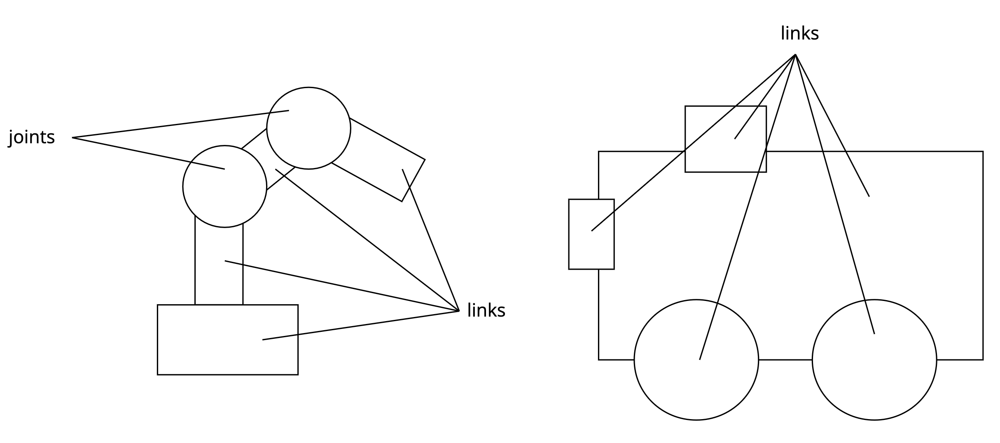
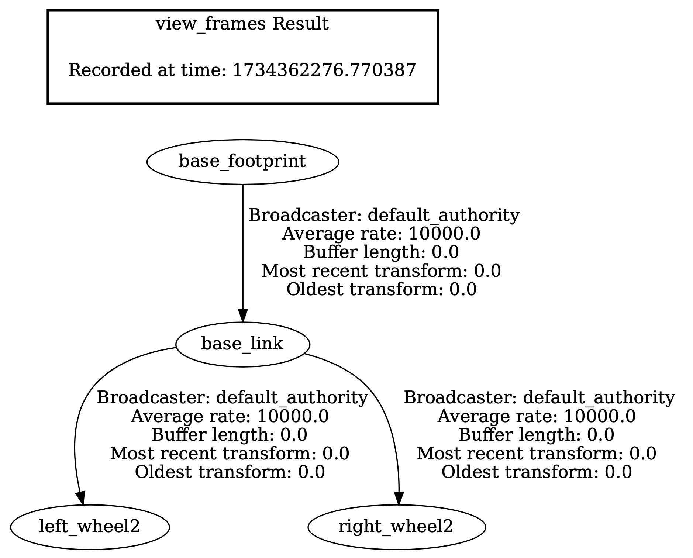
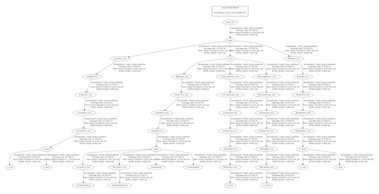
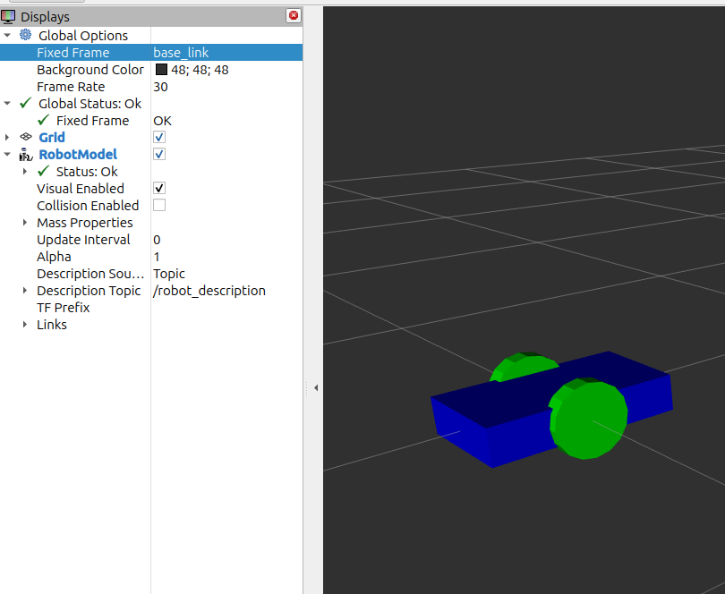

### URDF

URDF-tiedosto (Unified Robot Description Format) on XML-pohjainen tiedostomuoto, joka sisältää robotin rakenteellisen ja kinematiikkaan liittyvän kuvauksen. Se määrittelee esimerkiksi robotin rungot, nivelet, materiaalit ja mittasuhteet.



Malli koostuu nivelistä ja linkeistä. Nivelet voivat olla joko kiinteitä tai liikkuvia (kiinteästi paikallaan olevat linkit kuten anturit ja liikkuvat linkit kuten käsivarsi tai pyörät). Kun robottiin lisätään esimerkiksi LIDAR ja 3D-kamera, pistepilvet ja muu sensoridata saadaan yhteiseen koordinaatistoon, jolloin ne kuvaavat samaa ympäristöä.

URDF-mallin avulla voidaan visualisoida ja simuloida robotin rakennetta ja liikettä työkaluissa kuten RViz ja Gazebo.

Ennen seuraava vaihetta moottorinohjauksessa, luodaan malli robotista. Tämä mahdollistaa robotin liikkeiden seuraamisen paremmin RVIz-työkalun avulla, mikä auttaa visualisoimaan ja ymmärtämään toimintaa paremmin.

Luodaan ``diffdrive`` -paketti

```bash
cd ~/ros2_ws/src
ros2 pkg create --build-type ament_python diffdrive
```

Tehdään hakemistot asetuksille ja launch -tiedostoille.

```bash
cd ~/ros2_ws
mkdir config
cd ~/ros2_ws/src/diffdrive
mkdir launch
```

> Jatkossa laskennoissa ei huomioida tässä määriteltyjä robotin geometrisia ominaisuuksia. Tämän vuoksi, jotta liike vastaisi todellisuutta, on varmistettava, että pyörien halkaisija ja niiden välinen etäisyys ovat laskelmissa yhtenevät sekä tässä määriteltyjen että todellisen laitteiston arvojen kanssa.

**~/ros2\_ws/config/robot.urdf**

```xml
<?xml version="1.0"?>

<robot name="robot model">

  <link name="base_footprint"/>

   <link name="base_link">
     <visual>
      <geometry>
        <box size="0.5 0.3 0.1"/>
      </geometry>
      <material name="blue">
        <color rgba="0 0 1 1"/>
      </material>
      <origin xyz="0 0 0" rpy="0 0 0" />
    </visual>
  </link>

  <joint name="base_footprint_to_base_link" type="fixed">
    <parent link="base_footprint"/>
    <child link="base_link"/>
    <origin xyz="0 0 0.0" rpy="0 0 0"/>
  </joint>

  <link name="left_wheel">
    <visual>
      <geometry>
        <cylinder length="0.05" radius="0.1"/>
      </geometry>
      <material name="black">
        <color rgba="0 1 0 1"/>
      </material>
    </visual>
  </link>

  <link name="right_wheel">
    <visual>
      <geometry>
        <cylinder length="0.05" radius="0.1"/>
      </geometry>
      <material name="black">
        <color rgba="0 1 0 1"/>
      </material>
    </visual>
  </link>

  <joint name="base_to_left_wheel" type="fixed">
    <parent link="base_link"/>
    <child link="left_wheel"/>
    <origin xyz="0 0.15 0" rpy="-1.57 0 0"/>
  </joint>

  <joint name="base_to_right_wheel" type="fixed">
    <parent link="base_link"/>
    <child link="right_wheel"/>
    <origin xyz="0 -0.15 0" rpy="-1.57 0 0"/>
  </joint>

</robot>
```

Luodaan launch-skripti, joka julkaisee URDF-tiedoston ``robot_description`` -topicissa hyödyntäen ``robot_state_publisher`` -nodea. Tämä mahdollistaa mallin jakamisen RViz:n ja muiden nodejen käyttöön.

ROS2:n launch-tiedosto on käytännössä skripti, jolla käynnistetään yksi tai useampi ROS2-sovellus, kuten nodeja, parametreja tai muita prosesseja. Launch-tiedosto mahdollistaa järjestelmän osien hallinnan yhdestä paikasta ja tekee kompleksisten järjestelmien käynnistämisestä helpompaa ja joustavampaa.

**~/ros2\_ws/src/diffdrive/launch/diffdrive.launch.py**

```python
import os
from ament_index_python.packages import get_package_share_directory
from launch import LaunchDescription
from launch.actions import DeclareLaunchArgument
from launch.substitutions import LaunchConfiguration
from launch_ros.actions import Node

def generate_launch_description():
    use_sim_time = LaunchConfiguration('use_sim_time', default='false')
    #NAMESPACE = 'SeBotxx' # korvaa xx oman Sebotin tunnisteella, esimerkiksi IP-osoitteen viimeisellä tavulla.
    #FRAME_PREFIX = NAMESPACE+"_"
    # Työhakemisto
    colcon_prefix_path = os.getenv('COLCON_PREFIX_PATH').split("/install")[0]

    # Luetaan URDF -tiedosto robot_desc muuttujaan
    urdf_file_name = 'robot.urdf'
    urdf = os.path.join(
        colcon_prefix_path,
        'config',
        urdf_file_name)
    with open(urdf, 'r') as infp:
        robot_desc = infp.read()

    return LaunchDescription([
        DeclareLaunchArgument(
            'use_sim_time',
            default_value='false',
            description='Use simulation (Gazebo) clock if true'),
            
        # Käynnistettävä node
        Node(
            package='robot_state_publisher',
            executable='robot_state_publisher',
            name='robot_state_publisher',
            output='screen',
            #parameters=[{'use_sim_time': use_sim_time, 'robot_description': robot_desc, 'frame_prefix': FRAME_PREFIX}],# poista tämän rivin kommentti, jos haluat käyttää usean robotin namespace-järjestelyä. Kommentoi vastaavasti seuraava rivi pois.
            parameters=[{'use_sim_time': use_sim_time, 'robot_description': robot_desc}],
            #arguments=[urdf], # 26.5.2025 Tämä rivi on ylimääräinen, robot_state_publisher ei parsi komentoriviargumentteja erikseen. URDF-tiedosto välitetään sille parametreina.
            #namespace=NAMESPACE, # poista tämän rivin kommentti, jos haluat käyttää usean robotin namespace-järjestelyä.
            ),
        
        ## Lisätään muunnos map->[namespace]_odom jotta kaikki robotit saadaan mukaan samaan TF-puuhun. 
        #Node(
        #    package='tf2_ros',
        #    executable='static_transform_publisher',
        #    name='map_to_robot_odom',
        #    namespace=NAMESPACE,
        #    arguments=['0', '0', '0', '0', '0', '0',  # x y z yaw pitch roll
        #               'map', f'{FRAME_PREFIX}odom'],
        #    output='screen'
        #),
    ])
```

>Huomaa, että namespace-asetus voidaan kirjoittaa kätevästi osaksi launch-tiedoston node-luokan parametrilistaa, jolloin se tulee aina huomioiduksi automaattisesti. Voimme ajaa launch-tiedoston omassa hakemistossa ilman kääntämistä ja tarkistaa sen toiminta

Kokeillaan käynnistää ``diffdrive.launch.py`` ennen sen kääntämistä mukaan pakettiin:
```
cd ~/ros2_ws/src/diffdrive/launch
ros2 launch diffdrive.launch.py
```

Muokataan ``setup.py`` -tiedostoa siten, että myös config- ja launch-hakemistojen tiedostot lisätään mukaan paketin käännökseen. Tämä varmistaa, että kaikki tarvittavat resurssit, kuten konfiguraatio- ja käynnistystiedostot, ovat käytettävissä asennuksen jälkeen.

**~/ros2\_ws/src/diffdrive/setup.py**

```python
from setuptools import find_packages, setup
import os
from glob import glob

package_name = 'diffdrive'

setup(
    name=package_name,
    version='0.0.0',
    packages=find_packages(exclude=['test']),
    data_files=[
        ('share/ament_index/resource_index/packages',
            ['resource/' + package_name]),
        ('share/' + package_name, ['package.xml']),
        (os.path.join('share', package_name), glob('config/*')),
        (os.path.join('share', package_name, 'launch'), glob(os.path.join('launch', '*launch.[pxy][yma]*'))),

    ],
    install_requires=['setuptools'],
    zip_safe=True,
    maintainer='ros2',
    maintainer_email='ros2@todo.todo',
    description='TODO: Package description',
    license='TODO: License declaration',
    tests_require=['pytest'],
    entry_points={
        'console_scripts': [
        ],
    },
)
```

Käännetään projekti, ja koska olemme lisänneet uuden paketin, on tärkeää suorittaa source-komento uudelleen. Tämän jälkeen voimme käynnistää robotin URDF-mallin ja varmistaa sen toimivuuden.

```bash
cd ~/ros2_ws
colcon build --packages-select diffdrive
source ~/ros2_ws/install/setup.bash

ros2 launch diffdrive diffdrive.launch.py
```

Käyttämällä ROS2 vakiopakettien mukana tulevan ``tf2_tools``:in ``view_frames`` sovellusta voit saada käsityksen järjestelmässäsi olevien TF-kehysten hierarkiasta ja suhteista. Koska olet julkaissut robottisi URDF-mallin, voit tarkastella näitä kehyksiä, jotka URDF määrittelee, robotin runkoon ja pyöriin liittyen.

```bash
ros2 run tf2_tools view_frames -o robotframes

# Käytetään evince -pdf lukijaa
evince robotframes.pdf
```



Mitä enemmän robotissa on osia sitä monimutkaisempi TF-puusta tulee.


Ja miltä tuo malli näyttää käytännössä niin sitä voimme tarkemmin tarkastella RVIzissa.

Käynnistä RVIz

```bash
rviz2
```

RViz:ssa tulisi nyt näkyä robotin malli, kun lisäät RobotModel-visualisointityökalun ja asetat sen kuuntelemaan oikeaa ``robot_description`` -topicia. On tärkeää varmistaa, että URDF-tiedoston rakenteet ja parametrit on määritelty oikein, jotta mallin visualisointi vastaa odotuksia ja näyttää oheisen kuvan mukaiselta.




-
Nomga Oy - SeAMK - ROS 2 ja moottorinohjaus: PWM-signaalista robottien liikkeenhallintaan
