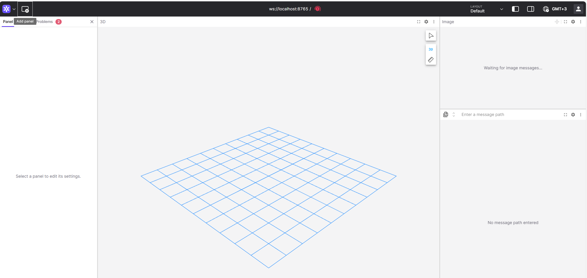

### Arduino

Arduinon koodi löytyy hakemistosta ``/opt/nomga/arduino/``

```bash
# Käännä koodi
compile.sh

# Lataa arduinoon
upload.sh
```

### ROS2

ROS2 koodit löytyvät hakemistosta ``/opt/nomga/ros2/``

Toimintaa voi testata

```bash
source /opt/nomga/ros2_ws/install/setup.bash
```

Hakemistosta ``/opt/nomga/ros2_ws/src/diffdrive/diffdrive/`` löytyy vielä ``pi_led.py`` tiedosto, joka sytyttää Raspberry PI GPIO23:een kytketyn ledin kun ajetaan ``ros2 launch diffdrive diffrive.launch.py`` ja kaikki on valmista. Huomaa, että kyseessä ei ole varsinainen ROS2 paketti eli sitä ei ajeta ros2 run ... komennolla.


Näiden .md tiedostojen jakaminen suljetussa lähiverkossa onnistuu code-kansiosta löytyvällä python-skriptillä serve_md_files.py, jonka hakemiston alihakemistossa /markdown_files on kopioituna nämä md-tiedostot.

### Foxglove Studio graafinen käyttöliittymä
Tässä materiaalissa on viitattu RVIZ2-nimisen visualisointityökalun käyttämiseen. Se ei kuitenkaan onnistu, mikäli käytössä ei ole graafisella työpöydällä varustettua, samassa ROS2-verkossa toimivaa Ubuntu-konetta. Mikäli haluat visualisoida liikkuvaa robottia myös ruudulla, voit käyttää [Foxglove](https://foxglove.dev/robotics/ros)-nimistä käyttöliittymäohjelmistoa, jota on mahdollista ajaa myös suoraan nettipalvelussa (eli asentamatta omalle koneelle Foxglove-serveriä).

Tähän tarvitset [Foxglove Bridge](https://docs.foxglove.dev/docs/connecting-to-data/ros-foxglove-bridge)-nimisen ohjelman, joka lähettää ROS2-ympäristön viestit Websocket-muodossa [Foxglove Studio](https://studio.foxglove.dev) palveluun. Palvelun käyttämiseksi sinun täytyy luoda käyttäjätunnus tai kirjautua siihen esimerkiksi Microsoft-tunnuksellasi.

Asennettuasi Foxglove Bridgen tietokoneellesi (joka on samassa ROS2-verkossa SeBotin Raspberry Pin kanssa), voit käynnistää sen vakioasetuksilla komennolla
```bash
ros2 launch foxglove_bridge foxglove_bridge_launch.xml
```

Päästyäsi sisään Foxglove Studio -palveluun, voit nyt luoda yhteyden oman robottisi ROS2-ympäristöön ottamalla käyttöön [websocket-kanavan](https://docs.foxglove.dev/docs/connecting-to-data/frameworks/ros2#foxglove-websocket) 



> Valitse 'Open data source' -> Foxglove WebSocket -> syötä Foxglove bridge -serverisi URL (eli käytännössä localhost:8765).

Nyt pääset käsiksi ROS2-ympäristöösi.

Halutessasi nähdä URDF-tiedoston mukaisen visualisoinnin, käynnistä ``robot_state_publisher`` (materiaali-3-URDF tai materiaali-4-diffdriven mukainen launch-tiedosto) ja syötä oheinen komento päätteeseen:
```bash
ros2 param set /robot_state_publisher robot_description "$(cat ~/ros2_ws/src/my_package/urdf/my_robot.urdf) # varmistetaan että robot_state_publisherilla on haluttu URDF-tiedosto parametrinään
```

Nyt robotin kuvaus on Foxglove Studion käytettävissä.

-
Nomga Oy - SeAMK - ROS 2 ja moottorinohjaus: PWM-signaalista robottien liikkeenhallintaan