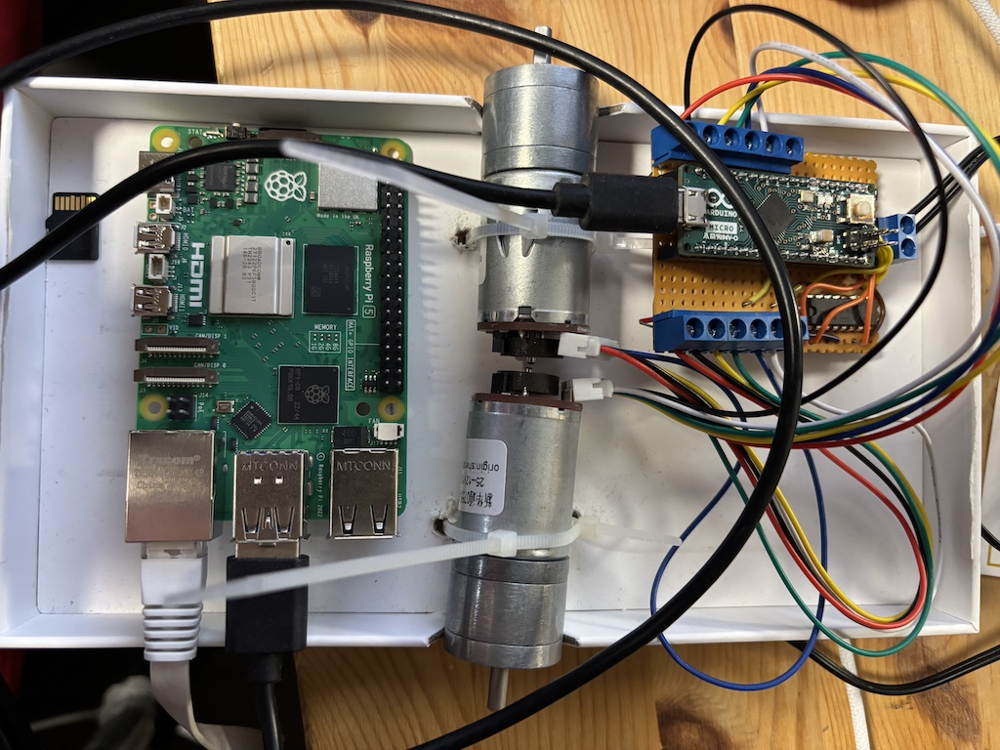

## Moottorinohjaus

### Yleiskuvaus



- Raspberry PI 5
- Arduino Micro
- [Moottoriohjain L293D](https://www.partco.fi/fi/elektroniikan-komponentit/aktiivit/mikropiirit-listana/ic-l/262-l293d.html)
- 2 x [DC-MOOTTORI VAIHTEISTOLLA 6-24VDC +ENKOODERI](https://www.partco.fi/fi/saehkoemekaniikka/moottorit/dc-moottorit/21183-mot-ams60085m.html)
- [DC 12V/24V to 5V USB C 5A 25W](https://www.amazon.com/dp/B0DDPL9QJR)


Kahdella pyörällä liikkuvan robotin liike perustuu renkaiden moottoreiden toimintaan, jotka saavat ohjeensa ylemmältä tasolta. ROS-ympäristössä nämä ohjeet annetaan yleensä cmd_vel-viesteissä, joissa määritellään robotin lineaarinen nopeus ja pyörimisnopeus. Näitä tietoja hyödyntäen robottiin kytketty ROS-node laskee kullekin renkaalle tarvittavat pyörimissuunnat ja nopeudet, jotka välitetään moottoriohjaimelle.

Tämä laskenta edellyttää seuraavia tietoja:

- Renkaiden halkaisija: Vaikuttaa lineaarisen nopeuden ja kulmanopeuden väliseen suhteeseen.
- Encoderin pulssimäärä per kierros: Tarvitaan tarkkaan liikkeen mittaamiseen ja nopeuden säätöön.
- Renkaiden välinen etäisyys (raideleveys): Vaikuttaa robotin kääntymisen laskentaan.

Moottoriohjain käyttää H-siltaa, kuten L293D-piiriä, renkaiden pyörimissuunnan ohjaamiseen, ja PWM-signaalia renkaiden pyörimisnopeuden säätöön. Vertaamalla encoderien signaalia asetettuihin arvoihin moottoriohjain saavuttaa tarkan nopeudensäätelyn PID-säätimen avulla, mikä mahdollistaa sekä suoran että pyörivän liikkeen tarkan ja hallitun toteutuksen.

**DC-moottorin ohjaus ja Arduino:**

Robotin moottorien ohjaukseen käytetään L293D H-siltapiiriä, joka mahdollistaa kahden moottorin hallinnan samanaikaisesti. Piiri on liitetty Arduino-mikrokontrolleriin, jossa on esimerkkiohjelma moottorien hallintaan. Ohjelma mahdollistaa:

- Moottorien ohjauksen suoraan PWM-komentojen avulla.
- Moottorien ohjauksen PID-säätimen avulla, joka tuottaa PWM-signaalin moottorien nopeuden säätämiseksi.

Ohjelma määrittää moottorin pyörimissuunnan PID-säätimen tai PWM-komennon tuottaman arvon perusteella:

- Positiivinen arvo ohjaa moottorin pyörimään eteenpäin.
- Negatiivinen arvo kääntää moottorin suunnan taaksepäin.

Tämä järjestelmä yhdistää ROS-ympäristön komennot ja Arduino-pohjaisen ohjauksen, mikä mahdollistaa tarkan ja joustavan robotin liikkeenhallinnan sekä nopeuden että suunnan osalta.

### Laitteisto


Arduino Micro, L293D, [DC6-24v Gear Motor with Encoder](https://www.elecrow.com/dc624v-gear-motor-with-encoder-p-1616.html)

### Kytkentä

Allaolevassa taulukossa on selvitetty kytkennät Arduino Micron, L293D piirin ja moottoreiden välillä.

 <table>
<tr>
<td valign="top">

| moottori  | toiminta   | arduino  | L293D  |
|-----------|------------|----------|--------|
| valkoinen | motor -    |          | 3 , 11 |
| sininen   | sensor +   |    +5V   |        |
| vihreä    | A          |  3 , 2   |        |
| keltainen | B          |  4 , 9   |        |
| musta     | sensor gnd |    GND   |        |
| punainen  | motor +    |          | 6 , 14 |


</td><td>

| PIN| L293D   | arduino  |  moottorit   |
|----|---------|----------|---------------
| 1  | enable1 |     5    |              |
| 2  | input1  |     6    |              |
| 3  | output1 |          | #1 valkoinen |
| 4  | gnd     |    GND   |              |
| 5  | gnd     |    GND   |              |
| 6  | output2 |          | #1 punainen  |
| 7  | input2  |     8    |              |
| 8  | Vs      |    +12V  |              |
| 9  | enable2 |     10   |              |
| 10 | input3  |     11   |              |
| 11 | output3 |          | #2 valkoinen |
| 12 | gnd     |    GND   |              |
| 13 | gnd     |    GND   |              |
| 14 | output4 |          | #2 punainen  |
| 15 | input4  |     12   |              |
| 16 | Vss.    |    +5V   |              |

</td>
</tr>
</table>

#### Komennot
Arduinoon on ohjelmoitu seuraavat komennot:

1. Suora säätö: ``PWM;100;100;``
2. PID säätö: ``SPD;100;100;``
3. PID arvot: ``PID;0.7;0.003;0.0;``
4. Nollaa enkooderit: ``ZERO;``
5. Säädä alive arvoa (0 = pois): ``ALIVE;3;``

PWM ja SPD -arvot vaihtelevat välillä -255 – +255. Nämä arvot itsessään eivät edusta nopeutta metreinä sekunnissa (m/s), vaan muunnos tapahtuu ROS-nodessa. Pyörimissuunta määräytyy arvon etumerkin perusteella.

Kaikki komennot palauttavat stringin:  ``encoder1;encoder2;rpm1;rpm2;pwm1;pwm2``

### Suora PWM ohjaus
``PWM;64;191;`` tarkoittaa, että moottorille #1 syötetään 25 %:n PWM-signaalia ja moottorille #2 75 %:n PWM-signaalia. Kun nämä signaalit kulkevat L293D-piirin läpi, piiri vahvistaa ne syöttöjännitteensä perusteella, jolloin saavutetaan moottoreille sopiva jännitetaso. L293D toimii tässä signaalivahvistimena ja ohjauselementtinä.


Moottorin maksiminopeus saavutetaan PWM-arvolla 255, mutta matalin nopeus riippuu useista tekijöistä, kuten moottorin ominaisuuksista, kuormasta, PWM-signaalin laadusta ja ympäristöolosuhteista. Tämä arvo voidaan määrittää käytännön testeillä ja tarvittaessa optimoida erilaisin menetelmin.

Maksimikiihtyvyys saavutetaan, kun moottori lähtee paikallaanolotilasta (PWM = 0) ja sille asetetaan heti maksimisyöttö (PWM = 255). Tällöin moottori toimii täydellä teholla alusta alkaen, jolloin kiihtyvyys on suurimmillaan.

Testaamme ohjainta yksinkertaisesti lähettämällä halutun pulssisuhteen (duty cycle), jolloin moottorit pyörivät tasajännitteellä ilman takaisinkytkentää. Tämä mahdollistaa ohjausjärjestelmän perustoimintojen tarkistamisen ennen suljetun piirin hallinnan käyttöönottoa.

Liitämme moottoriohjaimen USB-kaapelilla tietokoneeseen, jolloin sitä voidaan ohjata sarjaliikenteen (serial communication) avulla. Tämä yhteys mahdollistaa yksinkertaisen ja luotettavan tavan lähettää ohjauskomentoja moottoriohjaimelle.

**pwm.py**

```python
import serial
import time

try:
    speed = 100
    arduino = serial.Serial("/dev/ttyACM0", 115200, timeout=1)
    time.sleep(2.0) # odotetaan etta linja on varmasti auki
    arduino.write(("PWM;%s;%s;\n"%(speed,speed)).encode()) #annetaan pwm ohje kummallekin moottorille
    if arduino.isOpen():
        while(True):
            print("Moottorit pyorivat yha")
            time.sleep(3.0)
            
except KeyboardInterrupt:
        print("\nOhjelma keskeytetty, pysaytetaan moottorit.")
        arduino.write(("PWM;0;0").encode())
        
finally:
        print("Lopetetaan ohjelma")
```

Kummallekin moottorille lähetetään ohjausarvo 100, joka vastaa noin 40 % pulssisuhdetta ja pyörittää moottoreita samaan suuntaan. On kuitenkin tärkeää huomioida, että jos moottorit on asennettu robottiin differentiaaliajotyyppisesti (vastakkain), tämä ohjausarvo saa moottorit pyörimään vastakkaisiin suuntiin, jolloin robotti pyörii paikallaan eikä liiku eteen- tai taaksepäin. Tämä ilmiö on oleellista huomioida moottoreiden ja ohjausarvojen synkronoinnissa.

```bash
# Ajetaan ohjelma komennolla
python3 pwm.py
```
##### Jos mitään ei tapahdu, tarkista seuraavat asiat:

1. Liitokset: Varmista, että kaikki liitokset ovat tiukasti kiinni, erityisesti USB-kaapeli ja mahdolliset moottoriohjaimen virtakaapelit.
2. Virransyöttö: Tarkista, että moottoriohjaimeen on kytketty virta ja että virtalähde on toiminnassa.
3. Ohjausarvo: Moottorityypistä ja sen ominaisuuksista riippuen annettu ohjausarvo (esim. 100) saattaa olla liian pieni, jotta moottori jaksaisi pyöriä. Kokeile kasvattaa ohjausarvoa asteittain ja tarkkaile, alkaako moottori toimia.

Jos ongelmat jatkuvat, tarkista myös, että käytettävä sarjaliikenneprotokolla ja konfiguraatiot (esim. baud rate) ovat oikeat ja yhteensopivat moottoriohjaimen asetusten kanssa.

### Takaisinkytkentä

Teemme koodiin pienen lisäyksen, jonka avulla tulostamme moottoriohjaimelta saadun vastauksen. Vastaus saapuu muodossa:

```motor1_encoder;motor2_encoder;motor1_speed;motor2_speed;motor1_pwm_set;motor2_pwm_set```

Tämä lisäys mahdollistaa sen, että voimme tarkistaa moottorien encoder-arvot, nopeudet ja PWM-asetukset suoraan koodin tulosteista. Koodissa on myos kommenttimerkilla poistettu rivi, joka saa moottorien nopeuden vaihtelemaan satunnaisesti mielenkiinnon vuoksi.

```python
import serial
import time
import random
try:

    speed = 100
    arduino = serial.Serial("/dev/ttyACM0", 115200, timeout=1)
    time.sleep(2.0)
    if arduino.isOpen():
        while(True):
            # speed += random.randint(-10,10) # Ota kommenttimerkki pois, jos haluat kokeilla nopeuden muuttamista satunnaisesti.
            print(f"Vaihdetaan nopeus = {speed}")
            arduino.write(("PWM;%s;%s;\n"%(speed,speed)).encode())
            time.sleep(0.5) # nöytteenottovälin pituus

            if arduino.inWaiting()>0:
                answer=arduino.readline()
                print(answer)
                arduino.flushInput()
            
except KeyboardInterrupt:
        print("\nOhjelma keskeytetty, pysaytetaan moottorit.")
        arduino.write(("PWM;0;0").encode())
        
finally:
        print("Lopetetaan ohjelma")
```

Ja kun ajamme ohjelman, saamme vastauksia

```
python pwm.py

b'-552;-518;169;158;100;100\n'
b'-1324;-1237;179;166;100;100\n'
b'-2103;-1963;179;167;100;100\n'
b'-2884;-2692;180;168;100;100\n'
b'-3666;-3422;181;168;100;100\n'
b'-4449;-4154;180;168;100;100\n'
b'-5233;-4887;180;169;100;100\n'
b'-6018;-5621;181;169;100;100\n'
b'-6802;-6356;181;170;100;100\n'
b'-7588;-7093;181;170;100;100\n'
b'-8372;-7828;181;170;100;100\n'
b'-9158;-8564;181;169;100;100\n'
b'-9946;-9300;181;169;100;100\n'
b'-10735;-10037;181;169;100;100\n'
b'-11523;-10772;182;169;100;100\n'
b'-12312;-11508;182;169;100;100\n'
b'-13102;-12245;182;170;100;100\n'
```

Saaduista tiedoista voidaan muodostaa käyrät, jotka selkeyttävät tulosten tulkintaa. Käyrien avulla voimme varmistaa, että molemmat encoderit toimivat odotetusti, ja havaita, että moottori #2 pyörii hieman hitaammin annetulla ohjausarvolla, mikä johtaa myös hieman lyhyempään kuljettuun matkaan. Visualisointi tarjoaa selkeän tavan arvioida järjestelmän toimintaa sekä tunnistaa mahdolliset poikkeamat tai hienosäätöä vaativat kohdat.

Arvojen analysointi on helppoa kopioimalla ne Excel-taulukkoon ja luomalla viivagraafi. Kokeilemalla eri arvoja voit havainnoida, miten ne vaikuttavat moottorin pyörimiseen.


Mikäli encoder-arvot eivät päivity, vaikka moottori pyörii, tarkista kytkennät huolellisesti. Jos encoder-arvot näyttävät väärään suuntaan (esim. moottorit pyörivät samaan suuntaan mutta arvot vähenevät yhdellä encoderilla), signaalit voivat olla kytketty ristiin. Korjaa tällöin kytkennät vaihtamalla väärin kytketyt signaalijohdot oikein päin.

### PID Säädin

PID säätimen toimintaan voit tutustua tutustumalla arduinoissa olevaan koodiin.


Kun on varmistettu, että moottori pyörii odotetusti PWM-ohjauksella ja encoderit palauttavat oikeanlaisia arvoja, voidaan siirtyä käyttämään PID-säädintä. PID-säätimen avulla saavutamme tarkemman nopeudenhallinnan, jolloin moottorit pyörivät halutulla nopeudella riippumatta kuormituksesta tai muista häiriötekijöistä. Tämä vaihe mahdollistaa järjestelmän suorituskyvyn optimoinnin ja luo perustan tarkemmalle ohjaukselle.

SPD;127;127; tarkoittaa, että kumpikin moottori pyrkii pitämään nopeuden 127

Moottoriohjaimessa on SPD-komennolle sisäänrakennettu turvaominaisuus, joka pysäyttää moottorin automaattisesti, jos se ei saa uutta ohjetta määritetyn ajan sisällä (oletuksena 3 sekuntia). Tämä ominaisuus varmistaa, että moottori ei jää pyörimään hallitsemattomasti mahdollisten virhetilanteiden tai ylemmän tason ohjausjärjestelmän häiriöiden vuoksi. Näin moottori pysähtyy turvallisesti, mikä lisää järjestelmän luotettavuutta ja suojaa sekä laitteistoa että ympäristöä.

Voimme tehdä yksinkertaisen muutoksen korvaamalla PWM-komennon SPD-komennolla, jolloin moottoriohjain huolehtii itse PWM-asetusten laskemisesta saavuttaakseen halutun nopeuden.

```python
import serial
import time

try:
	speed = 100
	arduino = serial.Serial("/dev/ttyACM0", 115200, timeout=1)
	time.sleep(2.0)
	if arduino.isOpen():
	  while True:
	    arduino.write(("SPD;%s;%s;\n"%(speed,speed)).encode())
	    time.sleep(0.5) # naytteenottovali, voit kokeilla miten lyhyempi vali vaikuttaa ohjautuvuuteen.

	    if arduino.inWaiting()>0:
	      answer=arduino.readline()
	      print(answer)
	      arduino.flushInput()
	      
except KeyboardInterrupt:
	print("Pysaytetaan moottorit")
	arduino.write(("SPD;0;0").encode())
finally:
	print("Lopetetaan ohjelma")
```

Ja vastauksen saamme samalla tavalla kuin PWM-komennon kanssa, mutta nyt voimme suoraan havaita, että moottorin nopeus pyrkii pysymään annetussa arvossa, ja PWM-arvo vaihtelee automaattisesti moottoriohjaimen toimesta. Tämä vahvistaa, että moottoriohjain säätelee PWM-arvoja dynaamisesti kompensoidakseen kuorman tai muiden olosuhteiden muutoksia, mikä johtaa tasaisempaan nopeudenhallintaan.

```
b'-510;-498;141;135;20;32\n'
b'-926;-924;105;104;52;58\n'
b'-1354;-1354;101;100;57;61\n'
b'-1787;-1786;101;102;57;60\n'
b'-2216;-2216;99;99;58;62\n'
b'-2648;-2645;100;97;57;63\n'
b'-3081;-3075;101;98;57;62\n'
b'-3511;-3507;99;100;58;61\n'
b'-3945;-3939;100;100;57;62\n'
b'-4375;-4372;100;100;57;61\n'
b'-4806;-4802;99;100;58;61\n'
b'-5236;-5233;99;101;58;61\n'
b'-5668;-5665;101;100;57;61\n'
b'-6102;-6099;100;100;57;61\n'
b'-6532;-6527;100;99;57;62\n'
b'-6964;-6960;99;99;58;62\n'
b'-7399;-7393;101;99;56;61\n'
```


Kun vertaamme tasaisen PWM-säädön käyriä PID-säätimeltä saatujen käyrien kanssa, voimme havaita merkittävän parannuksen: PID-säätimen avulla moottorien nopeudet pysyvät tarkemmin asetetussa arvossa. Lisäksi näemme, että PWM-asetusarvot eroavat moottorien välillä siten, että hitaammin pyörivä moottori #2 vaatii hieman enemmän tehoa pysyäkseen samassa vauhdissa moottorin #1 kanssa. Tämä osoittaa PID-säätimen tehokkuuden nopeuksien tasaamisessa ja moottorien yksilöllisten eroavaisuuksien kompensoinnissa.

Käyrän alussa näkyvä omituisuus, jossa nopeus on suuri ja PWM-arvo pieni, johtuu siitä, että PID-säätimen ensimmäiset säätöarvot eivät ehdi tallentua kaavioon, kun käytämme 0,5 sekunnin viivettä tulosten tulostamisessa. Tämä viive aiheuttaa sen, että kaavion alkuhetken data ei täysin heijasta säätimen todellista käyttäytymistä.

Kun pienennämme näytteenottovälin 0,1 sekuntiin, saamme kyseisen tapahtuman paremmin näkyviin, ja näin PID-säätimen toiminta alkuvaiheessa voidaan analysoida tarkemmin. Tämä auttaa havaitsemaan mahdolliset poikkeamat tai optimointitarpeet.


Sovellamme samaa 0,1 sekunnin näytteenottoväliä myös PWM-säädön alussa, jotta saamme paremman käsityksen järjestelmän käyttäytymisestä heti käynnistyksessä. Tämä auttaa vertaamaan PWM-säätöä ja PID-säädintä tarkemmin alusta alkaen ja havaitsemaan esimerkiksi transienttivaiheessa tapahtuvat ilmiöt, kuten moottorin kiihtymisen ja PWM-arvojen muutokset.


Kuitenkin on tärkeää huomioida käytetyn moottoriohjaimen rajoitukset: liian tiheä datan kerääminen voi kuormittaa ohjainta ja hidastaa itse PID-säätimen toimintaa. Tällöin järjestelmän suorituskyky voi heikentyä, mikä voi johtaa virheellisiin johtopäätöksiin PID-piirin toimivuudesta. Näin ollen näytteenottovälin valinnassa on löydettävä tasapaino tarkkuuden ja järjestelmän toimivuuden välillä. Jos ohjain alkaa hidastua, tulisi harkita harvempaa näytteenottoa tai optimoida datan keruuta välttämällä turhia pyyntöjä.

### Vaihtoehtoja

Kun tavoitteena on saavuttaa moottoriohjaimelta parempaa suorituskykyä, FPGA (Field Programmable Gate Array) on erinomainen valinta suorittimeksi. FPGA mahdollistaa useiden tehtävien rinnakkaisen suorittamisen, mikä takaa nopean ja tehokkaan toiminnan. Tämä on erityisen hyödyllistä moottoriohjauksen kriittisissä tehtävissä, kuten PID-säätimessä, jossa suorituskyvyn on pysyttävä vakaana ja tarkkana riippumatta muista järjestelmän toiminnoista. FPGA:n rinnakkaisuus tekee siitä ihanteellisen valinnan korkean suorituskyvyn vaativiin sovelluksiin.

Jos projektin budjetti sallii, markkinoilla on myös saatavilla laaja valikoima kaupallisia moottoriohjaimia, jotka ovat hyvin testattuja ja toimintavarmoja. Näihin kuuluu yksinkertaisia DC-moottoriohjaimia, tarkkoja servo-ohjaimia ja monipuolisia robotiikan ohjausjärjestelmiä. Useimmat näistä tuotteista tarjoavat kattavan dokumentaation, teknisen tuen ja valmiit integraatiot esimerkiksi ROS-järjestelmään, mikä tekee niistä luotettavan ja helppokäyttöisen ratkaisun. Korkean laadun ja toimintavarmuuden vastapainona on usein korkeampi hinta, joten näiden tuotteiden valinta riippuu projektin tarpeista ja budjetista.

-
Nomga Oy - SeAMK - ROS 2 ja moottorinohjaus: PWM-signaalista robottien liikkeenhallintaan
