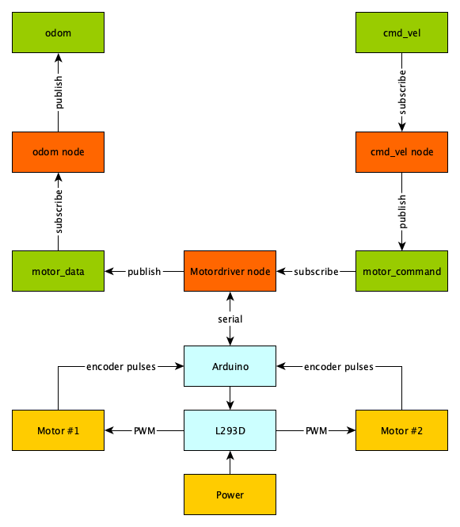
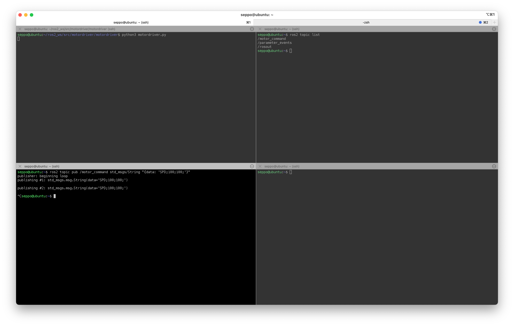
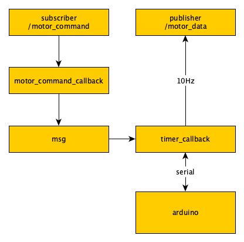

## 2. ROS 2 -pohjainen ohjaus

Materiaali testattu:

- Raspberry PI 5 (image: username: ros2 password: ros2)
- Ubuntu 24.04 (Noble Numbat)
- ROS2 Jazzy Jalisco (jazzy)
- moottori x2
- moottoriohjain
- arduino
- akku kytkentä

ROS2-nodea varten meillä on nyt valmiina osio, joka lähettää nopeusohjeen moottoriohjaimelle. Jotta node olisi käyttökelpoinen osana laajempaa järjestelmää, meidän tulee lisätä siihen seuraavat komponentit:

1. **Subscriber**: Tämä vastaanottaa nopeustiedon, joka ohjataan edelleen moottoriohjaimelle. Näin node voi toimia osana ROS2-järjestelmää ja vastaanottaa ohjauskomentoja toiselta nodelta.
2. **Publisher**: Tämä julkaisee tietoa moottorien toiminnasta, kuten encoder-arvot, moottorien toteutuneet nopeudet ja PWM-asetukset. Julkaistu data voidaan hyödyntää esimerkiksi:

	- Odometriassa: Encoder-arvojen avulla voidaan laskea robotin sijainti ja asento (x, y, θ) suhteessa aloituspisteeseen.
	
	- Tilavalvonnassa: Nopeus- ja PWM-arvot mahdollistavat moottorien tilan seurannan ja varmistavat, että ne toimivat odotetusti ja ilman häiriöitä.

3. **ROS_DOMAIN_ID ja namespace**: ROS2:n hyödyntämä DDS (Data Distribution Service) väliohjelmisto huolehtii kaikesta tietoliikenteen reitittämisestä ROS2 sovellusten (_node_) välillä. Koska tässä harjoituksessa voi olla useampi tietokone ja robotti samassa WLAN-verkossa, kaikki viestit "kuuluvat" kaikille nodeille kaikkien koneiden välillä. Tämän harjoituksen tapauksessa tämä on epätoivottavaa, sillä kukin opiskelija haluaa epäilemättä kontrolloida vain omaa SeBottiaan. Asiaan on kaksi ratkaisua:
  - vaihtaa ROS_DOMAIN_ID ympäristömuuttujan arvoksi yksilöllinen numero (vakioarvo 0:n sijaan). Kukin ROS2 node viestii vain oman ROS_DOMAIN_ID:nsä "sisällä".
  - hyödyntää _namespace_-toimintoa, jolla käynnistettävien nodejen kaikkien _topicien_, _servicejen_ ja _actionien_ (eli _interfacejen_) eteen lisätään automaattisesti annettu namespace-nimi. Tällöin esimerkiksi noden koodissa luotava /odom topic muunnetaan /[namespace]/odom muotoon.

Tässä harjoituksessa kokeillaan ensimmäistä vaihtoehtoa, jotta emme sotkeennu liian monimutkaiseen kokonaisuuteen. Näin ollen kannattaa ohittaa kaikki namespacen käyttöön viittaavat kohdat, jotka on merkitty materiaaliin hakasulkeilla, esimerkiksi ``[/[SeBot_namespace]]``.

Kun haluat muuttaa ROS_DOMAIN_ID-arvoa, kirjoita komentokehotteeseen

```bash
#export ROS_DOMAIN_ID=[arvo], esimerkiksi
export ROS_DOMAIN_ID=1
```

Tämä on voimassa vain kyseisessä komentokehotteessa. Jos haluat saada uuden ROS_DOMAIN_ID arvon voimaan aina komentokehotteen käynnistyessä, lisää ylläoleva rivi kotihakemistosta löytyvään ```.bashrc```-tiedoston loppuun:
```bash
nano ~/.bashrc # Tai muu editori
```
**~/.bashrc**
```
...
export ROS_DOMAIN_ID=1

>>ctrl+o, ctrl+x # Tallenna ja poistu nano-ohjelmasta
```
```bash
source ~/.bashrc # Lataa .bashrc-tiedosto uudestaan tässä komentokehotteessa
```

### Lopullinen toiminta



#### Motordriver Subscriber (motor_command)
Toteutamme subscriber-komponentin mahdollisimman yksinkertaisena käyttämällä std_msgs.msg.String -tyyppistä dataa. Tämä mahdollistaa sen, että ylemmällä tasolla voidaan lähettää suoraan moottoriohjaimen komentostringejä ilman tarvetta muuntaa tietoa eri formaatteihin. Näin vältämme turhaa monimutkaisuutta ja voimme testata ja käyttää nodea nopeasti.

Luodaan motordriver python paketti

```bash
mkdir -p ~/ros2_ws/src
cd ~/ros2_ws/src/
ros2 pkg create --build-type ament_python motordriver
cd ~/ros2_ws/src/motordriver/motordriver
```

Luodaan ```motordriver.py``` tiedosto, jossa hyödynnetään jo tekemäämme koodia moottoriohjaimen hallintaan. Tämä tiedosto toimii modulaarisena komponenttina, jota voidaan käyttää ROS2-nodessa tai muissa projekteissa.

**~/ros2\_ws/src/motordriver/motordriver/motordriver.py**

```python
import rclpy
from rclpy.node import Node

from std_msgs.msg import String

import serial
import time

class MotordriverNode(Node):
  def __init__(self):
    super().__init__('motordriver_node')

    self.arduino = serial.Serial("/dev/ttyACM0", 115200, timeout=1)
    if not self.arduino.isOpen():
      raise Exception("Ei yhteyttä moottoriohjaimeen")

    # moottori pysähtyy jos ei saa uutta komentoa 1s kuluessa
    self.arduino.write(("ALIVE;1;\n").encode())

    self.subscriber = self.create_subscription(
        String,
        'motor_command',
        self.motor_command_callback,
        10
    )

  def motor_command_callback(self, message):
    self.arduino.write(("%s\n"%message.data).encode())

def main(args=None):
  rclpy.init(args=args)
  motordriver_node = MotordriverNode()
  try:
    rclpy.spin(motordriver_node)
  except KeyboardInterrupt:
    pass
  finally:
    motordriver_node.destroy_node()
    if rclpy.ok():
      rclpy.shutdown()

if __name__ == '__main__':
  main()
```

``create_subscription`` on ROS2:n Node-luokan metodi, jonka avulla node voi tilata viestejä tietyltä topicilta. Kun topicille julkaistaan viesti, node suorittaa määritetyn palautefunktion (callback), joka käsittelee saapuvan viestin.
 

```python
    self.subscriber = self.create_subscription(
        String,				# msg_type
        'motor_command',		# topic_name
        self.motor_command_callback,	# callback
        10				# quos
    )
```

##### create_subscription -funktion parametrit:
1. msg_type
	
 	Määrittelee viestityypin, jota topicilla käytetään. 
2. topic_name
	
	Topicin nimi, jota node tilaa. Tämä tulee kirjoittaa ilman edeltävää kenoviivaa /, jotta topicin nimestä tulee suhteellinen (eikä absoluuttinen) ja siten namespace-asetus voi toimia.
3. callback

	Funktio, joka suoritetaan aina, kun topicilta saapuu viesti. Tämä funktio vastaanottaa parametrina topicilta tulevan viestin ja käsittelee sen, tässä tapauksessa kirjoitetaan sarjaporttiin.

	```python
  	def motor_command_callback(self, message):
   		self.arduino.write(("%s\n"%message.data).encode())
	```
4. qos (Quality of Service)

	Määrittelee viestien välityksen luotettavuuden ja suorituskyvyn.
	10 on luotettava ja vakioarvo pienille viestimäärille.

#### Testaus

Voimme testata ohjelman toiminnan ennen varsinaista käännöstä seuraavilla vaiheilla (huom: käytössä pitää olla useampi terminaali):



1. ##### Käynnistä moottoriohjainkoodi suoraan Pythonilla
  
  ```
  python3 motordriver.py
  ```
  
  Mikäli virheitä ei ilmene ``motordriver.py`` pitäisi toimia oikein sarjaliikenteen ja komentojen käsittelyn osalta. 
  
  **Huomaa, että vielä tässä vaiheessa kaikki samassa verkossa olevat SeBotit ottavat vastaan kaikki viestit samoista topiceista, jos ne on yllä olevan mukaan samoiksi määritetty koodeissa.** Jos harjoitusta tekee useampi opiskelija samaan aikaan, kannattaa syöttää skriptille käynnistyksen yhteydessä namespace-asetus (tai hyödyntää eri ```ROS_DOMAIN_ID```-ympäristömuuttujan arvoja).
  
  ```bash
  python3 motordriver.py
  #python3 motordriver.py --ros-args -r __ns:=/[SeBot_namespace]
  ```
  ```namespace```a ennen tulee olla kenoviiva /. Namespacena tässä harjoituksessa voisi käyttää oman SeBotin ip-osoitteen jälkimmäistä tavua, esimerkiksi
  ```bash
  python3 motordriver.py --ros-args -r __ns:=/SeBot11
  ```

2. ##### Katsotaan näkyykö topic listassa  

  ```
  ros2 topic list
  
  /motor_command
  ```

>  Jos samassa WLANissa on useita saman ```ROS_DOMAIN_ID```:n ROS2-sovelluksia kukin omalla namespace-asetuksellaan, listalla näkyy useita topiceja, esimerkiksi
>
>  ```
>  ros2 topic list
>
>  /SeBot11/motor_command
>  /SeBot12/motor_command
>  /SeBot13/motor_command
>  ```

3. ##### Lähetä nopeuskomento ROS2-topicia käyttäen

  ```bash
  # julkaisee toistuvasti
  ros2 topic pub [/[SeBot_namespace]]/motor_command std_msgs/String "{data: 'SPD;100;100;'}"
  
  # julkaisee toistuvasti 2 kertaa sekunnissa
  ros2 topic pub -r 2 [/[SeBot_namespace]]/motor_command std_msgs/String "{data: 'SPD;100;100;'}"
  
  # julkaise vain kerran
  ros2 topic pub -t 1 [/[SeBot_namespace]]/motor_command std_msgs/String "{data: 'SPD;100;100;'}"
  ```
  Huomaa namespacen käyttö. Jos sitä ei ole asetettu, ei sitä tarvitse myöskään tähän kutsuun kirjoittaa.

  Komento julkaisee ``motor_command`` topicille viestin joka on tyyppiä ``String`` ja sisältää tekstin ``SPD;100;100;`` Mikäli tekemäsi node on nyt käynnissä ja toimii oikein, moottoreiden pitäisi lähteä pyörimään.
  
### Kääntäminen osaksi ROS2 -järjestelmää

Kun ROS 2:ssa käännetään Python-paketteja, tarkoitetaan käytännössä nodejen ja pakettien rakentamista ja asentamista työtilaan (install hakemisto). Kun ohjelmat "kääritään" ROS2-paketeiksi, niitä voidaan ajaa ROS2-ympäristössä, jakaa helpommin muiden käyttäjien kanssa (esimerkiksi riippuvuudet Python- ja C++ kirjastoihin huomioiden) ja käynnistää _launch_-tiedostojen avulla kootusti.

Lisätään node ``setup.py``tiedostoon

**~/ros2\_ws/src/motordriver/setup.py**

```python
from setuptools import find_packages, setup

package_name = 'motordriver'

setup(
    name=package_name,
    version='0.0.0',
    packages=find_packages(exclude=['test']),
    data_files=[
        ('share/ament_index/resource_index/packages',
            ['resource/' + package_name]),
        ('share/' + package_name, ['package.xml']),
    ],
    install_requires=['setuptools'],
    zip_safe=True,
    maintainer='ros2',
    maintainer_email='ros2@todo.todo',
    description='TODO: Package description',
    license='TODO: License declaration',
    tests_require=['pytest'],
    entry_points={
        'console_scripts': [
            'motordriver = motordriver.motordriver:main',
        ],
    },
)
```

##### Käännetään (pythonin tapauksessa vain asennetaan)

```bash
cd ~/ros2_ws
colcon build --packages-select motordriver
```

Otetaan työtilan ``~/ros2_ws`` ympäristömuuttujat käyttöön.

```bash
source ~/ros2_ws/install/setup.bash
```

Ja lisätään sama komento ``~/.bashrc`` -tiedostoon, jotta se on aina automaattisesti käytössä.

```bash
>>nano ~/.bashrc # Tai muu haluamasi editori
source ~/ros2_ws/install/setup.bash
```


Kun ohjelma on käännetty osaksi järjestelmää se voidaan käynnistää komennolla

```bash
ros2 run motordriver motordriver [--ros-arg -r __ns:=/[SeBot_namespace]]

# Esimerkiksi
ros2 run motordriver motordriver --ros-arg -r __ns:=/SeBot11
```
Huomaa, että --ros-arg -r __ns:=/[SeBot_namespace] on eräs ilmentymä ROS2 ajonaikaisista _uudelleenohjauksista_. Valitsin -r viittaa sanaan _remap_, eli (interfacejen) uudelleenohjaus. Tässä kohdin jokainen opiskelija voi valita namespacekseen esimerkiksi SeBotinsa IP-numeron jälkimmäisen tavun. Tai jonkin muun yksilöivän tunnisteen. Myöhemmin tutustumme myös erilliseen _parametrien_ syöttövalitsimeen -p.

Ja testataan taas

```bash
ros2 topic pub [/[SeBot_namespace]]/motor_command std_msgs/String "{data: 'SPD;100;100;'}"

# Esimerkiksi
ros2 topic pub /SeBot11/motor_command std_msgs/String "{data: 'SPD;100;100;'}"
```


#### Motordriver Publisher (motor_data)

Lisätään ROS2-noden toiminnallisuuteen publisher, joka julkaisee moottoriohjaimelta luetut tiedot muiden nodejen käyttöön. Tämä mahdollistaa sen, että muut nodet voivat hyödyntää moottorin nopeuksia, encoder-arvoja ja PWM-asetuksia.

Eli tetoja jotka moottoriohjain palautti:
``motor1_encoder;motor2_encoder;motor1_speed;motor2_speed;motor1_pwm_set;motor2_pwm_set``

**custom message tyyppi**

Toisin kuin subscriber nodessa käyttämämme standardi viesti tyyppi ``std_msgs/String``, teemme nyt oman viesti tyypin, jotta julkaistava tieto moottoriohjaimelta on selkeämpää ja rakenteellisempaa. Tämä mahdollistaa eri tietokenttien helpon käsittelyn ja parantaa järjestelmän luettavuutta sekä laajennettavuutta.

```bash
cd ~/ros2_ws/src/
ros2 pkg create motordriver_msgs
cd ~/ros2_ws/src/motordriver_msgs/
rm -rf include/
rm -rf src/
mkdir msg
```

Luodaan tiedosto `~/ros2_ws/src/motordriver_msgs/msg/MotordriverMessage.msg` jossa määritellään 

**~/ros2\_ws/src/motordriver\_msgs/msg/MotordriverMessage.msg**

```yaml
int32 encoder1
int32 encoder2
int32 speed1
int32 speed2
```

Kun suoritimme komennon ``ros2 pkg create --build-type ament_python motordriver`` ROS 2 loi automaattisesti pakettirakenteen. Nyt käsittelemme tiedostoja ``package.xml``, josa on pakettikuvauksen määrittely ja ``CMakeLists.txt``, jossa on kääntämiseen liittyvät asetukset.

Muokataan package.xml tiedosto muotoon

**~/ros2\_ws/src/motordriver\_msgs/package.xml**

```xml
<?xml version="1.0"?>
<?xml-model href="http://download.ros.org/schema/package_format3.xsd" schematypens="http://www.w3.org/2001/XMLSchema"?>
<package format="3">
  <name>motordriver_msgs</name>
  <version>0.0.0</version>
  <description>TODO: Package description</description>
  <maintainer email="ros2@todo.todo">ros2</maintainer>
  <license>TODO: License declaration</license>

  <buildtool_depend>ament_cmake</buildtool_depend>

  <buildtool_depend>rosidl_default_generators</buildtool_depend>
  <exec_depend>rosidl_default_runtime</exec_depend>
  <member_of_group>rosidl_interface_packages</member_of_group>

  <test_depend>ament_lint_auto</test_depend>
  <test_depend>ament_lint_common</test_depend>

  <export>
    <build_type>ament_cmake</build_type>
  </export>
</package>
```

Muokataan CMakeLists.txt tiedosto muotoon

**~/ros2\_ws/src/motordriver\_msgs/CMakeLists.txt**

```python
cmake_minimum_required(VERSION 3.8)
project(motordriver_msgs)

if(CMAKE_COMPILER_IS_GNUCXX OR CMAKE_CXX_COMPILER_ID MATCHES "Clang")
  add_compile_options(-Wall -Wextra -Wpedantic)
endif()

# find dependencies
find_package(ament_cmake REQUIRED)
# uncomment the following section in order to fill in
# further dependencies manually.
# find_package(<dependency> REQUIRED)

if(BUILD_TESTING)
  find_package(ament_lint_auto REQUIRED)
  # the following line skips the linter which checks for copyrights
  # comment the line when a copyright and license is added to all source files
  set(ament_cmake_copyright_FOUND TRUE)
  # the following line skips cpplint (only works in a git repo)
  # comment the line when this package is in a git repo and when
  # a copyright and license is added to all source files
  set(ament_cmake_cpplint_FOUND TRUE)
  ament_lint_auto_find_test_dependencies()
endif()

find_package(rosidl_default_generators REQUIRED)
rosidl_generate_interfaces(${PROJECT_NAME}
  "msg/MotordriverMessage.msg"
 )
ament_export_dependencies(rosidl_default_runtime)

ament_package()
```

Käännetään uusi viesti tyyppi osaksi järjestelmää.

```
cd ~/ros2_ws
colcon build --packages-select motordriver_msgs
source ~/ros2_ws/install/setup.bash
```

Muokataan ``motordriver.py``tiedostoa lisäämällä sinne publisher motor_data topic:lle. Ajastetaan se kysymään tietoa 10Hz taajuudella.



**~/ros2\_ws/src/motordriver/motordriver/motordriver.py**

```python
import rclpy
from rclpy.node import Node

from std_msgs.msg import String

import serial
import time

from motordriver_msgs.msg import MotordriverMessage

class MotordriverNode(Node):
  def __init__(self):
    super().__init__('motordriver_node')

    self.msg = "x\n"
    self.timercount = 0

    self.arduino = serial.Serial("/dev/ttyACM0", 115200, timeout=1)
    if not self.arduino.isOpen():
      raise Exception("Ei yhteyttä moottoriohjaimeen")

    self.subscriber = self.create_subscription(
        String,
        'motor_command', # suhteellinen viittaus. Jos eteen kirjoittaa kenoviivan, esimerkiksi '/motor_command', siitä tulee absoluuttinen, eikä namespace-asetus enää vaikuta siihen.
        self.motor_command_callback,
        10
    )

    self.publisher = self.create_publisher(
        MotordriverMessage,
        'motor_data',
        10
    )

    timer_period = 0.01  # Sekuntia
    self.timer = self.create_timer(timer_period, self.timer_callback)

  def timer_callback(self):
    # Luodaan viesti Arduinolle
    if self.msg != "x\n":
        self.arduino.write(self.msg.encode())

    if self.timercount == 11:
        if self.msg == "x\n":
            self.arduino.write(self.msg.encode())

        self.timercount = 0
        if self.arduino.inWaiting()>0:
          while self.arduino.inWaiting()>0:
            answer=self.arduino.readline().decode("utf8").split(";")
          
          msg = MotordriverMessage()

          try:
            msg.encoder1 = int(answer[0])
            msg.encoder2 = int(answer[1])
            msg.speed1 = int(answer[2])
            msg.speed2 = int(answer[3])

            # Julkaistaan viesti topicissa
            self.publisher.publish(msg)
          except Exception as err:
            pass

    self.msg = "x\n"
    self.timercount += 1
    
  def motor_command_callback(self, message):
    self.msg = "%s\n"%(message.data)

def main(args=None):
  rclpy.init(args=args)
  motordriver_node = MotordriverNode()
  try:
    rclpy.spin(motordriver_node)
  except KeyboardInterrupt:
    pass
  finally:
    motordriver_node.destroy_node()
    if rclpy.ok():
      rclpy.shutdown()


if __name__ == '__main__':
  main()
```

Otetaan uusi viesti tyyppi käyttöön

```python
from motordriver_msgs.msg import MotordriverMessage
```

Viesti joka lähetetään moottoriohjaimelle. "x\n" vain lyhyt viesti, jotta saadaan vastaukset luettua.

```python
    self.msg = "x\n"
```

``create_publisher`` on ROS2:n Node-luokan metodi, jonka avulla voidaan luoda publisher, eli viestien lähettäjä, tietylle topicille. Publisher mahdollistaa sen, että node voi jakaa tietoa muille nodeille ROS2-järjestelmässä.

```python
    self.publisher = self.create_publisher(
        MotordriverMessage,	# msg_type eli viestin ROS2 tietotyyppi.
        'motor_data',		# topicin nimi, huomaa että tässä ei käytetä edessä kenoviivaa /, jotta namespace-asetus voi toimia. Jos kenoviivan kirjoittaa topicin eteen, siitä tulee absoluuttinen viittaus suhteellisen viittauksen sijaan.
        10					# qos
    )
```

##### Parametrit:
1. msg_type
	
	Viestityyppi, jota topic käyttää.
	
2. topic_name

Topicin nimi, johon viesti julkaistaan.

3. qos (Quality of Service)

	Laadunhallintaprofiili, joka määrittää, kuinka viestejä käsitellään, jos lähettäjän ja vastaanottajan välinen yhteys ei ole täydellinen. Luku 10, riittää useimpiin tilanteisiin.

Luomme ajastimen, joka pyörii 100Hz taajuudella. Ohjaimelle tulevaa ohjauskäskyä ei lähetetä suoraan vaan se lähetetään ajastimessa. Ajastimessa luetaan 10Hz taajuudella uusia arvoja moottoriohjaimelta. Näin pyritään estämään liiallinen epäsäännöllinen liikenne, joka haittaisi PID säätimen toimintaa.

```python
    timer_period = 0.01  # Sekuntia
    self.timer = self.create_timer(timer_period, self.timer_callback)

  def timer_callback(self):
    # Luodaan viesti
    if self.msg != "x\n":
        self.arduino.write(self.msg.encode())


    if self.timercount == 11:
        if self.msg == "x\n":
            self.arduino.write(self.msg.encode())
        self.msg = "x\n"

        self.timercount = 0
        if self.arduino.inWaiting()>0:
          answer=self.arduino.readline().decode("utf8").split(";")
          self.arduino.flushInput()

          msg = MotordriverMessage()

          try:
            msg.encoder1 = int(answer[0])
            msg.encoder2 = int(answer[1])
            msg.speed1 = int(answer[2])
            msg.speed2 = int(answer[3])

            # Julkaistaan viesti
            self.publisher.publish(msg)
          except Exception as err:
            pass

    self.timercount += 1

  def motor_command_callback(self, message):
    self.msg = "%s\n"%(message.data)
```

Voimme taas käynnistä noden yksinkertaisesti (huom: source... pitää olla ajettuna):
```bash
python3 motordriver.py [--ros-args -r __ns:=/[SeBot_namespace]]
```
Ja tarkistaa, että kumpikin node on käynnissä (huomioiden jälleen, että tässä vaiheessa kaikkien samassa DOMAIN_ID:ssä olevien SeBotin topicit ovat samoja, jos ne on niin koodeihin kirjoitettu).

```bash
ros2 topic list

[/SeBot_namespace]/motor_command
[/SeBot_namespace]/motor_data
```

Moottorin pyörittämisen pitäisi toimia samalla tavalla kuin aiemmin
```bash
ros2 topic pub [/[SeBot_namespace]]/motor_command std_msgs/msg/String "{data: 'SPD;100;-100;'}"
```
Ja lisäksi meidän pitäisi saada arvoja (muista source käsky jos ajat vanhassa ikkunassa)

```bash
ros2 topic echo [/[SeBot_namespace]]/motor_data

	encoder1: 22663
	encoder2: 23018
	speed1: 102
	speed2: 99
	---
	encoder1: 22569
	encoder2: 22924
	speed1: 99
	speed2: 100
	---
	encoder1: 22474
	encoder2: 22829
	speed1: 99
	speed2: 100
	---
	encoder1: 22379
	encoder2: 22735
	speed1: 101
	speed2: 100
```

Kaikki kunnossa? Käännetään paketti

```bash
cd ~/ros2_ws
colcon build --packages-select motordriver
```

Ja nyt voimme käynnistää node:n

```bash
ros2 run motordriver motordriver
```

Näin olemme luoneet noden, joka välittää ``motor_command``-topiciin julkaistut komennot moottoriohjaimelle ja julkaisee ``[SeBot_namespace/]`` ``motor_data``-topicista moottorin nopeustiedot sekä enkooderin arvot. Jos haluamme, voimme lisätä PWM ohjaus arvot myös luomaamme ``MotordriverMessage``-viesti tyyppiin ja näin pääsemme halutessamme lukemaan mitä PWM arvoja SPD komento moottorille antaa.

Lisätään **~/ros2\_ws/src/motordriver\_msgs/msg/MotordriverMessage.msg** tiedostoon:

```yaml
int32 pwm1
int32 pwm2
```

ja **~/ros2\_ws/src/motordriver/motordriver/motordriver.py** tiedostoon:

```python
msg.pwm1 = int(answer[4])
msg.pwm2 = int(answer[5])
```

Voimme kääntää kummatkin paketit kerralla:

```bash
cd ~/ros2_ws
colcon build --packages-select motordriver motordriver_msgs
```

Simulointi ilman oikeaa moottoriohjainta. Tehdään emulaattori sarjaportin vaihtoehdoksi.

**~/ros2\_ws/src/motordriver/motordriver/simserial.py**

```python
import time
import threading

class SimSerial():
  def __init__(self):
    self.answer = [0,0,0,0,0,0]
    self.response = 0
    self.encoder_min = -32768
    self.encoder_max = 32768
    self.sim_odo_left = SimuOdo(self.encoder_min, self.encoder_max)
    self.sim_odo_right = SimuOdo(self.encoder_min, self.encoder_max)

  def write(self,message):
    try:
      a = message.decode().split(";")
      self.sim_odo_left.set_speed(int(a[1]))
      self.sim_odo_right.set_speed(int(a[2]))

      self.answer[4] = self.sim_odo_left.speed
      self.answer[5] = self.sim_odo_right.speed

    except Exception as err:
      pass

    self.answer[0] = self.sim_odo_left.tell_ticks()
    self.answer[1] = self.sim_odo_right.tell_ticks()

    self.response = 1

  def inWaiting(self):
    return self.response

  def readline(self):
    retval = ";".join([str(x) for x in self.answer]).encode()
    self.response = 0
    return retval


class SimuOdo():
    """Tämä luokka 'simuloi' fyysistä enkooderia, mikä mahdollistaa ROS2-koodikokonaisuuden ajamisen ilman fyysistä laitteistoa."""
    def __init__(self, encoder_min, encoder_max):
        self.speed = 0
        self.ticks = 0
        self.encoder_min = encoder_min
        self.encoder_max = encoder_max
        thread = threading.Thread(target = self.run_periodically)
        thread.start()
    def run_periodically(self):
        while True:
            self.roll()
            time.sleep(0.1)

    def set_speed(self, speed):
        self.speed = speed

    def roll(self):
        self.ticks = self.ticks + self.speed
        if self.ticks > self.encoder_max:
          self.ticks -= self.encoder_max-self.encoder_min
        if self.ticks < self.encoder_min:
          self.ticks += self.encoder_max-self.encoder_min

    def tell_ticks(self):
        return self.ticks
```

Muokataan motordriver.py tiedostoa:

**~/ros2\_ws/src/motordriver/motordriver/motordriver.py**

```python
.
.
.
try:
  from .simserial import SimSerial
except:
  from simserial import SimSerial

class MotordriverNode(Node):
  def __init__(self):
    super().__init__('motordriver_node')

    self.msg = "x\n"
    self.timercount = 0

	 # jos simulation parametria ei löydy niin oletuksena se on True
    self.declare_parameter('simulation', True)
    self.simulation = self.get_parameter('simulation').value
    self.get_logger().info(f'Käynnistetään motor_controller simulaatiossa: {self.simulation}')
    if self.simulation:
      self.arduino = SimSerial()
    else:
      self.arduino = serial.Serial("/dev/ttyACM0", 115200, timeout=1)
      if not self.arduino.isOpen():
        raise Exception("Ei yhteyttä moottoriohjaimeen")

    self.subscriber = self.create_subscription(
        String,
        'motor_command',
        self.motor_command_callback,
        10
    )

    self.publisher = self.create_publisher(
        MotordriverMessage,
        'motor_data',
        10
    )

    timer_period = 0.01  # seconds
    self.timer = self.create_timer(timer_period, self.timer_callback)        
.
.
.        
```

Nyt voit lisätä parametrin komentorivillä. Vertaa aiemmassa kohdassa tehtyyn ``namespace``-asetukseen, joka tehtiin -r (joka on sama kuin --remap) valitsimella.

```bash
python3 motordriver.py --ros-args -p simulation:=False [-r __ns:=/[SeBot_namespace]]
```

Tai kääntämisen jälkeen:

```bash
ros2 run motordriver motordriver --ros-args -p simulation:=False [-r __ns:=/[SeBot_namespace]]
```

Lisätään parametri asetustiedostoon (False = käytetään oikeaa sarjaporttia). Launch tiedostoa varten.

**~/ros2\_ws/config/params.yaml**

```yaml
motordriver_node:
  ros__parameters:
    simulation: False
```

**Huomaa, että noden parametritiedostoon ei voi kirjoittaa namespace-asetusta. Se ei ole varsinainen parametri, vaan ajonaikainen uudelleenohjaus (remapping).**

-
Nomga Oy - SeAMK - ROS 2 ja moottorinohjaus: PWM-signaalista robottien liikkeenhallintaan
