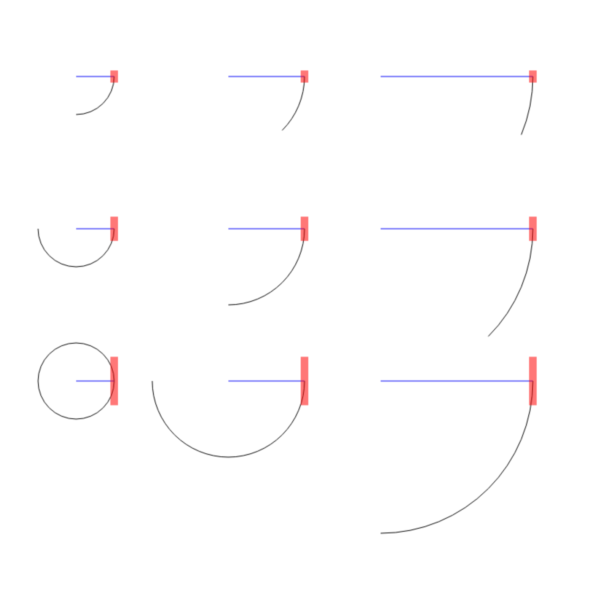
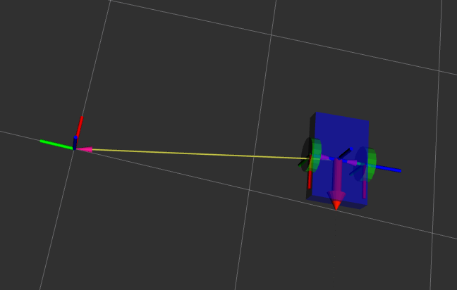
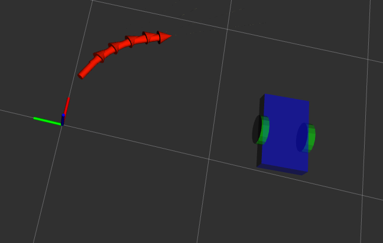
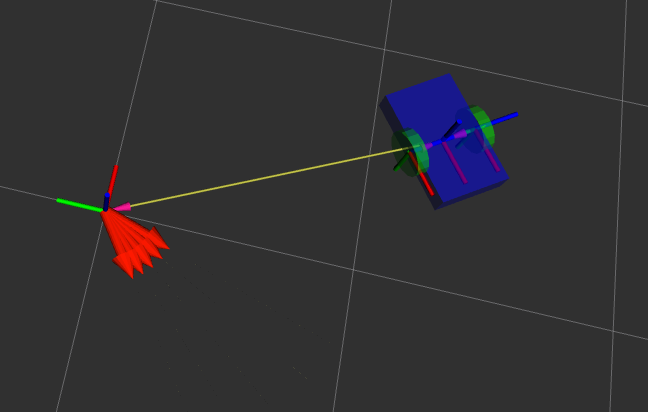
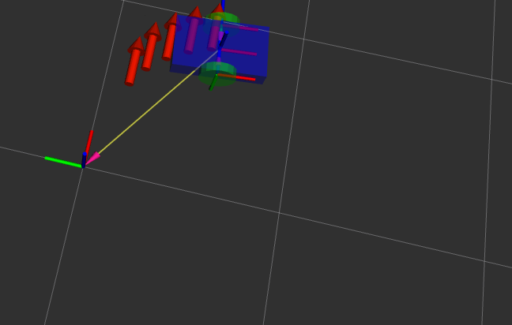
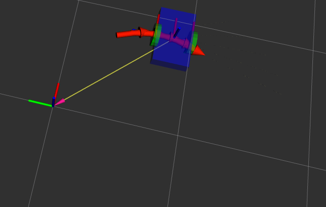
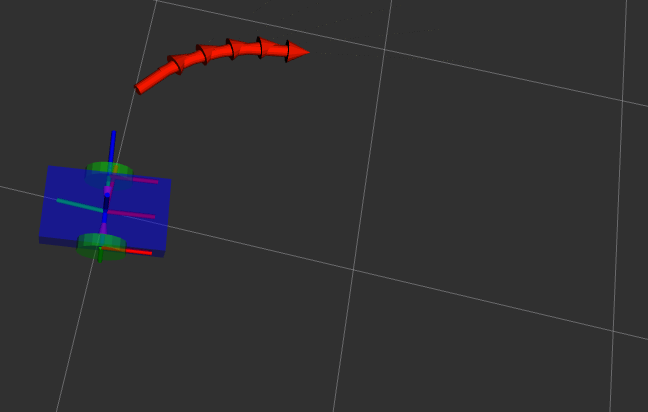
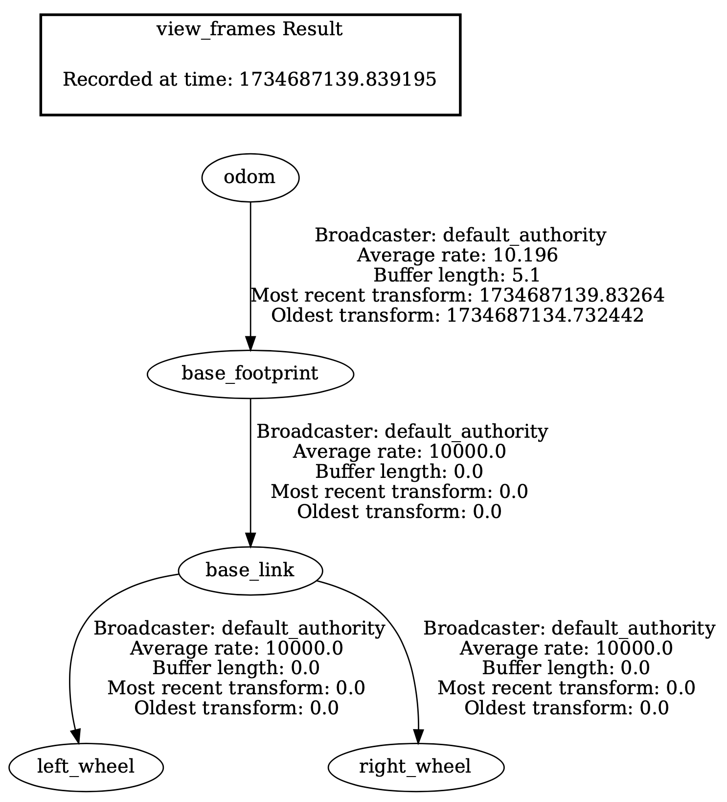
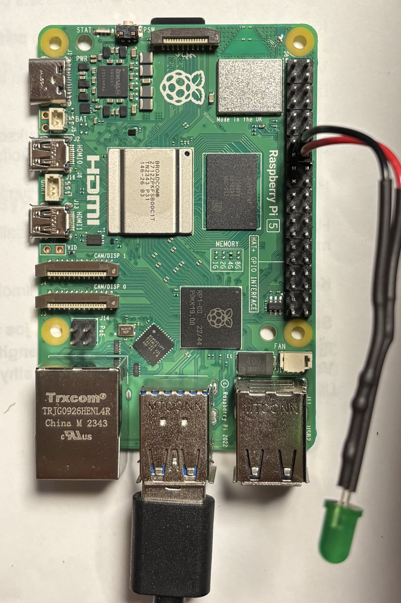

### Differential drive

Differential Drive on kahdella pyörällä toimiva robotiikan liikkumismekanismi, jossa robottia ohjataan säätämällä pyörien pyörimisnopeuksia. Toinen pyörä voi pyöriä nopeammin, hitaammin tai jopa vastakkaiseen suuntaan kuin toinen, mikä mahdollistaa robotin suunnanmuutokset ja paikoillaan kääntymisen.

Differential Drive on yksinkertainen ja tehokas mekanismi, joka ohjaa robotin liikettä kahden pyörän nopeus- ja suuntaerojen avulla. Se on suosittu ratkaisu erityisesti ROS-järjestelmässä, jossa ``cmd_vel``-topicin avulla määritellään robotin lineaarinen- ja kulmanopeus käyttämällä viestityyppiä ``geometry_msgs/msg/Twist``. Tämä viestityyppi on standardoitu liikkuville roboteille, erityisesti differential drive -järjestelmiä varten.

``geometry_msgs/msg/Twist`` viestityyppi sisältää kaksi vektorikenttää:

- linear: Kuvaa lineaarista nopeutta (m/s) kaikilla kolmella akselilla (x, y, z).
- angular: Kuvaa kulmanopeutta (rad/s) kaikilla kolmella akselilla (x, y, z).

Differential Drive -roboteille merkittävät komponentit ovat:

- linear.x: Lineaarinen nopeus eteenpäin (positiivinen) tai taaksepäin (negatiivinen).
- angular.z: Kulmanopeus robottia ympäröivän pystyakselin ympäri.

Muut komponentit (linear.y, linear.z, angular.x, ja angular.y) eivät yleensä ole käytössä 2D-ympäristössä.

Kun ``cmd_vel`` -topic hallitsee robotin nopeuksia, ``odom`` -topic tarjoaa tietoa robotin todellisesta sijainnista ja orientaatiosta. Odometry-laskenta julkaisee nämä tiedot ``odom`` -topicissa, mikä mahdollistaa robotin sijainnin seuraamisen reaaliaikaisesti.

### Odometry

``/odom``-topic: Tämä julkaisee tietoa robotin sijainnista ja orientaatiosta suhteessa alkuperäiseen lähtöpisteeseen.

Odometriikan laskenta perustuu tässä tapauksessa pelkästään moottoreiden enkoodereiden tuottamaan tietoon. On tärkeää huomioida, että tämä menetelmä ei ole täysin tarkka, sillä renkaiden ja alustan välinen vuorovaikutus, kuten liukuminen ja kitka, aiheuttaa väistämättä virheitä sijainnin ja liikkeen arvioinnissa. Vaikka tämä laskentamenetelmä ei takaa täydellistä tarkkuutta, se tarjoaa kuitenkin luotettavan perustan robotin sijainnin ja liikkeen seuraamiselle. Koska tässä esimerkissä muita antureita ei ole käytössä, enkooderipohjainen odometriikka on robotin ainoa käytettävissä oleva navigointimenetelmä.

#### Odometry-laskennan toiminta lyhyesti

Odometry-laskenta perustuu robotin pyörien liikkeiden mittaamiseen ja näiden tietojen hyödyntämiseen robotin sijainnin ja orientaation (x, y, θ) määrittämiseksi ajan kuluessa.

- Pyörän liikkuma matka saadaan kun tiedetään pyörän halkaisija ja enkooderin lukema yhdeltä kierrokselta.
- Ero vasemman ja oikean pyörän liikkeessä: Lasketaan vasemman ja oikean pyörän kulkema matka.
Pyörien välinen ero määrittää robotin kääntymisen ja suuntamuutoksen.

**Renkaat**

Renkaan säteellä ja renkaiden välisellä etäisyydellä on merkittävä vaikutus differential drive -robotin liikkeeseen ja ohjaukseen. Ne vaikuttavat suoraan robotin liikeradan, nopeuden ja kulmanopeuden laskentaan.

Oheisessa kuvassa havainnollistetaan, miten renkaiden koko ja niiden välinen etäisyys vaikuttavat robotin liikkeeseen, kun toinen rengas liikkuu tietyllä nopeudella ja toinen pysyy paikallaan. Eli esim. ajetaan moottoria 3 s nopeudella 0,1 m/s.



- Renkaan koko:
	- Pienempi rengas liikkuu lyhyemmän matkan yhdellä kierroksella.
	- Suurempi rengas liikkuu pidemmän matkan samalla kierrosmäärällä.
- Renkaiden välinen etäisyys:
	- Lyhyt etäisyys: Tuottaa jyrkemmän käännöksen, koska kaaren säde pienenee.
	- Pitkä etäisyys: Tekee käännöksestä loivemman, koska suurempi etäisyys vaatii pidemmän matkan kaaren muodostumiseksi.
- Liikuttua matkaa laskettaessa:
	- Kuljettu matka riippuu renkaan koosta ja kääntösäteestä:
		- Pienempi rengas + lyhyt etäisyys → lyhyt matka ja tiukka kaarre.
		- Suurempi rengas + pitkä etäisyys → pitkä matka ja loiva kaarre.

**Encoder luokka**

Luodaan Pythonilla apuluokka Encoder, joka vastaa enkooderien lukemien hallinnasta ja laskennasta. Useimmissa enkoodereissa lukema nollautuu maksimilukeman jälkeen, jolloin kierrokset alkavat alusta. Tämä luokka pitää tarkasti kirjaa pyörän pyörimiskierroksista, jotta pyörän absoluuttinen sijainti voidaan laskea oikein myös silloin, kun enkooderin lukema ylittyy tai nollautuu.

**~/ros2\_ws/src/diffdrive/diffdrive/encoder.py**

```python
import math

class Encoder():
  encoder_min =  -32768
  encoder_max =  32768
  encoder_range = encoder_max - encoder_min

  encoder_low_wrap = (encoder_range * 0.3) + encoder_min
  encoder_high_wrap = (encoder_range * 0.7) + encoder_min


  def __init__(self, wheel_radius, ticks_per_revolution):

    self.wheel_radius = wheel_radius
    self.ticks_per_revolution = ticks_per_revolution

    # renkaan säde R = 0.1m
    # enkooderin resoluutio E = 1000 tick / kierros

    # renkaan kehä: 2 * pi * R
    # kierrokset per metri = 1m / renkaan kehä
    # ticks per metri = E * (1m / (2 * pi * R)) = E / (2 * pi * R)

    self.ticks_per_meter = self.ticks_per_revolution / (2 * math.pi * self.wheel_radius)

    self.offset = None
    self.encoder = None
    self.prev_encoder = None

    self.position = 0
    self.prev_position = None

    self.multiplier = 0


  def update(self, encoder):
    if self.encoder == None:
      self.offset = encoder
      self.prev_encoder = encoder

    self.encoder = encoder

    # enkoodereissa, jotka mittaavat rotaatiota, on usein rajallinen arvoalue (esim. 0–4095 12-bittisellä enkooderilla).
    # Kun enkooderin arvo "kääntyy ympäri" (esim. 4095 -> 0 tai päinvastoin), tämä logiikka varmistaa, että oikea
    # sijainti säilyy seuraamalla täysiä kierroksia.
    #
    # self.encoder: Nykyinen enkooderin lukema.
    # self.prev_encoder: Edellisen kierroksen enkooderin lukema.
    # self.encoder_low_wrap: Alarajan lähellä oleva kynnysarvo (0 + marginaali)
    # self.encoder_high_wrap: Ylärajan lähellä oleva kynnysarvo (4095 − marginaali)
    # self.multiplier: Laskuri, joka seuraa täysiä kierroksia
    #
    # eli kun edellinen arvo on ylä alueella (esim: 4090-4095) ja nykyinen ala alueella
    # (esim: 0-5) niin silloin absoluuttinen asema lisääntyy ja toiseen suuntaan taas
    # absoluuttinen asema vähenee. Kaikissa muissa tapauksissa ollaan samalla kierroksella

    if (self.encoder < self.encoder_low_wrap) and (self.prev_encoder > self.encoder_high_wrap):
      self.multiplier += 1
    if (self.encoder > self.encoder_high_wrap) and (self.prev_encoder < self.encoder_low_wrap):
      self.multiplier -= 1

    self.position = self.encoder + self.multiplier * self.encoder_range - self.offset

    self.prev_encoder = self.encoder


  def deltam(self):
    if self.prev_position == None:
      self.prev_position = self.position
      return 0
    else:
      d = (self.prev_position - self.position) / self.ticks_per_meter
      self.prev_position = self.position
      return d
```

**Transformaatio**

Transformaatioiden avulla lasketaan robotin sijainti ja orientaatio suhteessa eri koordinaatistoihin. Kun haluamme visualisoida robotin liikkeen RViz-ympäristössä, on tärkeää, että ``odom``- ja ``base_footprint``-kehysten välinen transformaatio on määritetty oikein. Tämä transformaatio yhdistää robotin fyysisen sijainnin (``base_footprint``) sen suhteelliseen sijaintiin odometrian lähtöpisteessä (``odom``).

**RViz Global Options ja Fixed Frame**

Fixed Frame määrittää, minkä koordinaatiston (kehyksen) mukaan kaikki muut kehykset näytetään RViz:ssä.

Jos asetamme Fixed Frame-arvoksi ``base_footprint``:

- Robotin sijainti näytetään suhteessa itseensä, mikä tarkoittaa, ettei mitään liikettä visualisoida, vaikka robotti liikkuisi.
- Tämä johtuu siitä, että base_footprint pysyy aina robotin rungossa ja seuraa sitä.

Jos asetamme Fixed Frame-arvoksi ``odom``:

- Robotin liike visualisoidaan suhteessa ``odom``-kehykseen, joka toimii odometrian lähtöpisteenä.
- Tämä mahdollistaa robotin todellisen liikkeen seuraamisen ruudulla.

**Miten transformaatio vaikuttaa?**

Kun robotti liikkuu, ``odom``-kehys pysyy paikallaan, ja ``base_footprint`` siirtyy sen suhteen. ``odom`` -> ``base_footprint``-transformaatio päivitetään jatkuvasti, ja RViz käyttää tätä tietoa piirtääkseen robotin sijainnin ja orientaation.

Transformaatioiden laskennan ja julkaisun sijainti riippuu robotin järjestelmän arkkitehtuurista sekä vaaditun paikannuksen tarkkuudesta ja mahdollisesta integraatiosta muiden sensoreiden, kuten IMU:n tai LiDAR:n kanssa.

Transformaatiot voidaan toteuttaa suoraan ``odom``-nodessa, jos odometria toimii järjestelmän ainoana sijaintilähteenä. Tämä lähestymistapa on erityisen sopiva yksinkertaisille järjestelmille, joissa ei ole käytössä muita antureita.

Jos kuitenkin käytössä on useita sensoreita, on suositeltavaa käyttää ROS2:n yleisesti käytettyihin paketteihin kuuluvan ´´robot_localizationin´´ EKF (Extended Kalman Filter) -nodea. EKF yhdistää kaikki saatavilla olevat tiedot, kuten enkooderit, IMU:n, LiDAR:n ja GPS:n, ja tuottaa tarkemman arvion robotin sijainnista ja orientaatiosta. Tämä parantaa paikannustarkkuutta ja kompensoi yksittäisten sensorien mahdollisia virheitä.

**Tilanne IMU:n (Inertial Measurement Unit) kanssa:**

IMU tuo tarkempaa dataa robotin todellisesta liikkeestä, mikä auttaa kompensoimaan pyöräluiston aiheuttamaa virhettä.

Kulmanopeus (Yaw-Rate): 
IMU:n gyroskooppi mittaa kulmanopeuksia (esim. kääntymistä z-akselin ympäri).
Jos toinen pyörä luistaa ja pyöräenkooderit antavat väärää kulmanopeustietoa, IMU voi tunnistaa todellisen kulmanopeuden ja korjata suunta- ja sijaintitiedot.
Tämä estää vääristymän kertyessä robotin orientaatioon (yaw).

Kiihtyvyys (Linear Acceleration)
IMU:n kiihtyvyysanturit mittaavat robotin liikkeen kiihtyvyyttä x- ja y-suunnassa.
Pyöräluiston aikana enkooderien arvioima lineaarinen liike voi olla väärä, mutta IMU voi tunnistaa todellisen kiihtyvyyden ja auttaa arvioimaan todellista nopeutta.
Tämä vähentää virhettä robotin paikannuksessa.


**Tilanne LiDAR:n (Light Detection and Ranging) kanssa:**

LiDAR täydentää pyöräenkoodereiden rajoituksia tuottamalla tarkkaa tietoa robotin ympäristöstä.

Etäisyyksien mittaus: LiDAR kartoittaa ympäristöä mittaamalla etäisyyksiä robotin ympärillä oleviin esteisiin ja rakenteisiin.

Staattiset viitteet: LiDAR voi tunnistaa pysyviä ympäristön piirteitä, kuten seinät ja huonekalut, joita käytetään robotin sijainnin määrittämiseen suhteessa ympäristöön.

**Driftin korjaaminen**

Absoluuttista paikkaa tarjoavia paikannusmenetelmiä (kuten kamera- tai LiDAR-pohjainen SLAM, GNSS-paikannus, UWB-paikannus) hyödyntämällä voidaan havaita robotin todellisen liikkeen suhteessa ympäristöön ja korjata pyöräenkooderien kertyneen virheen. 

Esimerkiksi, jos pyöräenkooderit osoittavat, että robotti on siirtynyt tiettyyn kohtaan, mutta LiDAR:n havainto ympäristöstä kertoo muuta, paikannus voidaan korjata yhdistämällä tiedot. ROS2:n tapauksessa yleinen tapa tehdä tällaista korjausta on syöttää eri paikannusmenetelmien tietovirrat ``robot_localization``-paketin EKF-suodattimelle.

Nyt kun enkooderit ovat ainoa sijaintilähteemme, toteutamme transformaatioiden julkaisemisen suoraan ``odom``-nodessa joka on yksinkertainen ja tehokas ratkaisu.

**~/ros2\_ws/src/diffdrive/diffdrive/odom.py**

```python
import rclpy
from rclpy.node import Node

from nav_msgs.msg import Odometry
from tf_transformations import quaternion_from_euler

from geometry_msgs.msg import TransformStamped
from tf2_ros import TransformBroadcaster

from motordriver_msgs.msg import MotordriverMessage

import math

try:
    from .encoder import Encoder
except:
    from encoder import Encoder


class OdomNode(Node):
  def __init__(self):
    super().__init__('odom_node')

    # Lue parametrit
    self.declare_parameter('wheel_radius', 0.1)
    self.declare_parameter('wheel_base', 0.5)
    self.declare_parameter('ticks_per_revolution', 1075)

    # Hae parametrien arvot
    self.wheel_radius = self.get_parameter('wheel_radius').value
    self.wheel_base = self.get_parameter('wheel_base').value
    self.ticks_per_revolution = self.get_parameter('ticks_per_revolution').value

    self.get_logger().info(f'Pyörän säde: {self.wheel_radius}')
    self.get_logger().info(f'Pyörien etäisyys: {self.wheel_base}')
    self.get_logger().info(f'Anturin kierros: {self.ticks_per_revolution}')

    ## Otetaan framelle etuliite parametrinä tai jos parametriä ei syötetä, otetaan se namespace-tiedosta.
    #self.declare_parameter('frame_prefix', '')
    #frame_prefix_param = self.get_parameter('frame_prefix').get_parameter_value().string_value
    #if frame_prefix_param:
    #    self.frame_prefix = frame_prefix_param + '_'
    #else:
    #    ns = self.get_namespace().strip('/')
    #    self.frame_prefix = f'{ns}_' if ns and ns != '' else ''

    #if self.frame_prefix:
    #        self.get_logger().info(f'Käytetään frame-etuliitettä: "{self.frame_prefix}"') 
    

    self.left_encoder = Encoder(self.wheel_radius, self.ticks_per_revolution)
    self.right_encoder = Encoder(self.wheel_radius, self.ticks_per_revolution)

    self.odom_theta = 0.0
    self.odom_x = 0.0
    self.odom_y = 0.0

    self.motor_subscriber = self.create_subscription(
        MotordriverMessage,
        'motor_data',
        self.update_encoders_callback,
        10
    )

    self.odom_publisher = self.create_publisher(
        Odometry,
        'odom',
        10
    )

    # TransformBroadcaster tarvitsee viitteen pääluokkaan saadakseen tarvittavan kontekstin
    # (noden  asetukset tai muun jaetun datan). Tämä tapahtuu antamalla self parametrina.
    self.tf_broadcaster = TransformBroadcaster(self)

    self.prev_time = self.get_clock().now().nanoseconds

    timer_period = 0.1 # Sekuntia
    self.timer = self.create_timer(timer_period, self.timer_callback)
    self.update = True

  def update_encoders_callback(self, message):
    # Tallennetaan messagessa olevat tiedot, jotta niitä voidaan käsitellä timer_callback:ssa
    self.left_encoder.update(message.encoder1)
    self.right_encoder.update(-message.encoder2)
    self.update = True

  def timer_callback(self):
    if not self.update: return
    self.update = False
    current_time = self.get_clock().now().nanoseconds
    elapsed = (current_time - self.prev_time)/1000000000
    self.prev_time = current_time

    d_left= self.left_encoder.deltam()
    d_right = self.right_encoder.deltam()

    # Kuljettu matka (delta_distance) lasketaan ottamalla vasemman ja oikean pyörän kulkema matka
    # jaettuna kahdella. Robotin liikkuma matka suoraviivaisesti keskilinjan (robottia keskeltä
    # halkova akseli) pitkin.
    # Kulman muutos (delta_theta) lasketaan ottamalla vasemman ja oikean pyörän kulkeman matkan erotus ja
    # jakamalla se pyörien välisellä etäisyydellä
    # Jos pyörät liikkuvat yhtä paljon samaan suuntaan (𝑑_left=𝑑_right -> delta_theta=0), robotti liikkuu
    # suoraan eteen- tai taaksepäin.
    # Jos pyörät liikkuvat yhtä paljon erisuuntiin (𝑑_left=-𝑑_right -> delta_distance=0), robotti pyörii
    # paikallaan
    delta_distance = (d_left + d_right) / 2.0
    delta_theta = (d_left - d_right) / self.wheel_base

    if delta_distance != 0:
      robot_x = math.cos( delta_theta ) * delta_distance
      robot_y = -math.sin( delta_theta ) * delta_distance
      self.odom_x = self.odom_x + ( math.cos( self.odom_theta ) * robot_x - math.sin( self.odom_theta ) * robot_y )
      self.odom_y = self.odom_y + ( math.sin( self.odom_theta ) * robot_x + math.cos( self.odom_theta ) * robot_y )

    linear_y = delta_distance * math.cos(self.odom_theta) / elapsed
    linear_x = delta_distance * math.sin(self.odom_theta) / elapsed
    angular_z = delta_theta / elapsed

    self.odom_theta = delta_theta + self.odom_theta

    odom_msg = Odometry()
    odom_msg.header.stamp = self.get_clock().now().to_msg()
    #odom_msg.header.frame_id = self.frame_prefix + 'odom' # Lisätään framen nimen eteen namespacen (tai parametrin) mukainen etuliite.
    #odom_msg.child_frame_id = self.frame_prefix + 'base_footprint'
    odom_msg.header.frame_id = 'odom'
    odom_msg.child_frame_id = 'base_footprint'

    # pose sisältää kaksi osaa:
    # position (geometry_msgs/Point)
    #  x, y, z: Robotin sijainti koordinaatistossa.
    # orientation (geometry_msgs/Quaternion)
    #  x, y, z, w: Robotin orientaatio quaternion-muodossa (3D-rotaatio).
    odom_msg.pose.pose.position.x = self.odom_x ##
    odom_msg.pose.pose.position.y = self.odom_y ##
    odom_msg.pose.pose.position.z = 0.0

    quat = quaternion_from_euler(0.0, 0.0, self.odom_theta)
    odom_msg.pose.pose.orientation.x = quat[0] ##
    odom_msg.pose.pose.orientation.y = quat[1] ##
    odom_msg.pose.pose.orientation.z = quat[2] ##
    odom_msg.pose.pose.orientation.w = quat[3] ##

    # Nopeudet (valinnainen, ei käytössä tässä sovelluksessa)
    odom_msg.twist.twist.linear.x = linear_x
    odom_msg.twist.twist.linear.y = linear_y
    odom_msg.twist.twist.angular.z = angular_z

    # Julkaistaan odometry viesti
    self.odom_publisher.publish(odom_msg) ##

    t = TransformStamped()
    t.header.stamp = self.get_clock().now().to_msg()
    #t.header.frame_id = self.frame_prefix + 'odom'
    #t.child_frame_id = self.frame_prefix + 'base_footprint'
    t.header.frame_id = 'odom'
    t.child_frame_id = 'base_footprint'

    t.transform.translation.x = self.odom_x ##
    t.transform.translation.y = self.odom_y ##
    t.transform.translation.z = 0.0

    # z: Quaternionin osa, joka liittyy rotaatioon  z-akselin suuntaan. Tämä ei yksinään ole kulma,
    # vaan osa rotaation akselin ja kulman yhteistä esitystä.
    # w: Quaternionin skaalarikomponentti, joka määrittää, kuinka suuri osa rotaatiosta tulee akselin
    # ympäriltä. Suhteessa muihin quaternion-komponentteihin, tämä määrittää kulman.

    t.transform.rotation.z = math.sin(self.odom_theta / 2.0) ##
    t.transform.rotation.w = math.cos(self.odom_theta / 2.0) ##

    # Julkaistaan transformaatio
    self.tf_broadcaster.sendTransform(t) ##


def main(args=None):
  rclpy.init(args=args)

  odom_node = OdomNode()

  try:
    rclpy.spin(odom_node)
  except KeyboardInterrupt:
    pass
  finally:
    odom_node.destroy_node()
    if rclpy.ok():
      rclpy.shutdown()

if __name__ == '__main__':
  main()
```

Nyt voimme testata ohjelman toimintaa. Suorita seuraavat komennot eri terminaaleissa ja varmista, että kaikki tarvittavat nodet ovat käynnissä. Jos seuraat robottiasi RViz:ssa ja asetat Fixed Frame -asetukseksi ``[SeBot_namespace]`` ``/odom``, robotin pitäisi liikkua visualisointinäkymässä odotetusti.

```bash
# Käynnistä motordriver node (muista source)
ros2 run motordriver motordriver 
#ros2 run motordriver motordriver [--ros-args -r __ns:=/[SeBot_namespace]]

# Testataan odom -nodea
python3 odom.py
#python3 odom.py --ros-args -r __ns:=/[SeBot_namespace]

# Tulostetaan mitä /odom -topic näyttää
ros2 topic echo /odom
#ros2 topic echo /[SeBot_namespace]/odom

# Aja eteenpäin
ros2 topic pub /motor_command std_msgs/String "{data: 'SPD;100;-100;'}"
#ros2 topic pub /[SeBot_namespace]/motor_command std_msgs/String "{data: 'SPD;100;-100;'}"

# Aja taaksepäin
ros2 topic pub /motor_command std_msgs/String "{data: 'SPD;-100;100;'}"

# Pyöri paikallaan
ros2 topic pub /motor_command std_msgs/String "{data: 'SPD;100;100;'}"

# Aja ympyrää
ros2 topic pub /motor_command std_msgs/String "{data: 'SPD;150;-100;'}"
```

Kun sekä ``odom`` että ``transformaatio`` toimivat oikein, voit visualisoida nämä RVizissä, jolloin punainen Odometry-nuoli ja robotin malli osoittavat samaan suuntaan ja sijaitsevat kohdakkain.


Koodissa on rivejä joiden perässä on ``##`` kommentoimalla näitä rivejä pois eri tavalla ja käynnistämällä ohjelman uudelleen voidaan nähdä miten nämä vaikuttavat odometryn ja transformaation toimintaan.

Julktaistaan pelkkä /odom topic, transformaatio on viimeisessä paikassa johon julkaistu


/odom topicissa vain rotaatio


/odom topicissa vain paikka


transformaatiosta vain paikka


transformaatiosta vain rotaatio


Kun julkaiset transformaatioiden ketjun ``odom`` -> ``base_footprint``, se ilmestyy TF-tree-rakenteeseen, joka kuvaa kaikkien TF-kehysten välisiä suhteita. Tämä on olennainen osa robotin sijainnin seuraamista suhteessa paikalliseen odom-kehykseen.



Kun siirrytään kohti autonomista ajoa, TF-treehen lisätään myös ``map``-kehys. Tämä muodostaa transformaatioiden ketjun ``map`` -> ``odom`` -> ``base_footprint``, jolloin robotin sijaintia voidaan seurata tarkasti sekä kartalla että paikallisessa koordinaatistossa. Tämä mahdollistaa robotin etenemisen tarkastelun sekä paikallisesti että globaalisti. Jos tätä harjoitusta tehdään monen SeBotin kanssa samassa ``ROS_DOMAIN_ID``:ssä, on tarpeen luoda hieman keinotekoinen ``map``-kehys. Tästä esitetään mallin tuonnempana ``launch``-tiedoston yhteydessä.

### Twist

Seuraavaksi siirrymme käsittelemään ``cmd_vel`` -topicia. Sen avulla voimme ohjata robottia yksinkertaisemmin määrittämällä suoraan lineaarisen nopeuden ja kulmanopeuden. Tämä lähestymistapa poistaa tarpeen ohjata moottoreita erikseen ja tekee liikkeiden hallinnasta intuitiivisempaa.

``cmd_vel``-topicin käyttö yhdessä Nav2-järjestelmän kanssa mahdollistaa robotin autonomisen ajon. Nav2 ohjaa robottia lähettämällä lineaarisen nopeuden ja kulmanopeuden komentoja ``cmd_vel`` -topiciin, jolloin robotti voi navigoida itsenäisesti määritetyn kartan ja reitin perusteella.

Käytännössä ``cmd_vel``-node muuntaa lineaarisen nopeuden ``linear.x`` ja kulmanopeuden ``angular.z`` pyöräkohtaisiksi nopeus ohjeiksi, joita ``motor_command ``-topic ymmärtää: ``SPD;vel_l;vel_r;``

**~/ros2\_ws/src/diffdrive/diffdrive/cmd_vel.py**

```python
import rclpy
from rclpy.node import Node

from geometry_msgs.msg import Twist
from std_msgs.msg import String

import math

class CmdVelNode(Node):
  def __init__(self):
    super().__init__('cmd_vel_node')

    # Lue parametrit
    self.declare_parameter('wheel_radius', 0.1)
    self.declare_parameter('wheel_base', 0.5)
    self.declare_parameter('ticks_per_revolution', 1075)

    # Hae parametrien arvot
    self.wheel_radius = self.get_parameter('wheel_radius').value
    self.wheel_base = self.get_parameter('wheel_base').value
    self.ticks_per_revolution = self.get_parameter('ticks_per_revolution').value

    self.get_logger().info(f'Pyörän säde: {self.wheel_radius}')
    self.get_logger().info(f'Pyörien etäisyys: {self.wheel_base}')
    self.get_logger().info(f'Anturin kierros: {self.ticks_per_revolution}')

    self.cmd_vel_subscriber = self.create_subscription(
        Twist,
        'cmd_vel',
        self.cmd_vel_callback,
        10
    )

    self.mc_publisher = self.create_publisher(
        String,
        'motor_command',
        10
    )

  def mps_to_spd(self,mps):
    # muunnetan m/s moottoriohjaimen spd arvoksi
    pid_freq = 10 # Moottoriohjain päivittyy 10Hz taajuudella

    # kulmanopeus (rad/s)
    radps = mps / self.wheel_radius

    # RPM
    rpm = radps * ( 60 / ( 2 * math.pi ) )

    spd = rpm * (self.ticks_per_revolution / 60 / pid_freq)
    return spd

  def cmd_vel_callback(self, msg):
    # mps_l = vasen rengas m/s
    # mps_r = oikea rengas m/s
    mps_l = +(msg.linear.x + (msg.angular.z * self.wheel_base / 2.0))
    mps_r = -(msg.linear.x - (msg.angular.z * self.wheel_base / 2.0))

    string_msg = String()
    string_msg.data = "SPD;%i;%i;"%(self.mps_to_spd(mps_l), self.mps_to_spd(mps_r))

    self.mc_publisher.publish(string_msg)

def main(args=None):
  rclpy.init(args=args)

  cmdvel_node = CmdVelNode()

  try:
    rclpy.spin(cmdvel_node)
  except KeyboardInterrupt:
    pass
  finally:
    cmdvel_node.destroy_node()
    if rclpy.ok():
      rclpy.shutdown()


if __name__ == '__main__':
  main()
```

Nyt on aika kokeilla ohjelmaa. Pidä ``motordriver``- ja ``odom``-nodet sekä RViz käynnissä. Tällä kertaa lähetä viestit ``cmd_vel``-topiciin sen sijaan, että käyttäisit suoraan ``motor_command``-topiceja. Näin voit testata robotin ohjausta nopeuden ja kulmanopeuden avulla.

```bash
# Käynnistetään cmd_vel node
python3 cmd_vel.py

# Robotti liikkuu eteenpäin 0.5 m/s:
ros2 topic pub /cmd_vel geometry_msgs/Twist "{linear: {x: 0.5, y: 0.0, z: 0.0},	angular: {x: 0.0, y: 0.0, z: 0.0}}"
# Sama huomioiden namespace:
ros2 topic pub /[SeBot_namespace]/cmd_vel geometry_msgs/Twist "{linear: {x: 0.5, y: 0.0, z: 0.0}, angular: {x: 0.0, y: 0.0, z: 0.0}}"


# Robotti kääntyy vastapäivään paikallaan (kulmanopeus 1 rad/s):
ros2 topic pub /cmd_vel geometry_msgs/Twist "{linear: {x: 0.0, y: 0.0, z: 0.0}, angular: {x: 0.0, y: 0.0, z: 1.0}}"

# Robotti liikkuu kaarella myötäpäivään (eteenpäin + käännös):
ros2 topic pub /cmd_vel geometry_msgs/Twist "{linear: {x: 0.3, y: 0.0, z: 0.0}, angular: {x: 0.0, y: 0.0, z: -0.5}}"
```
### Lisätehtävä: Teleop_twist_keyboard
Robotin ajaminen yksittäisillä komentorivikehotteilla on työlästä. Varsinaisesti ideana on toki se, että robotin ohjauskokonaisuus antaa näitä komentoja enemmän tai vähemmän itsenäisesti ("autonominen ajaminen"), mutta tämän harjoituksen puitteissa hyvä väliaskel on ottaa käyttöön jokin manuaalisen etäohjaamisen mahdollistava ROS2 paketti. Helpointa on kokeilla ohjausta näppäimistöllä, minkä mahdollistaa [teleop_twist_keyboard](https://index.ros.org/r/teleop_twist_keyboard/).
```bash
sudo apt install ros-jazzy-teleop-twist-keyboard
ros2 run teleop_twist_keyboard teleop_twist_keyboard

#ros2 run teleop_twist_keyboard teleop_twist_keyboard.py --ros-args -r /cmd_vel:=/[SeBot_namespace]/cmd_vel # Jos käytössä on namespace

```

``teleop_twist_keyboard`` voidaan ohjata julkaisemaan twist-viestejä myös johonkin muuhun topiciin parametrillä ``--ros-args --remap cmd_vel:=[joku_muu_topic]``. Jos harjoituksessa on mukana vain yksi SeBot tai kukin toimii omassa ``ROS_DOMAIN_ID``:ssä, käytämme oletuksena ``/cmd_vel``-topicia, eikä topicia pitäisi olla tarpeen säätää, sillä ``/cmd_vel`` on yleisesti käytetty standardi ROS 2:ssa.

Mikäli haluat ohjata robottia peliohjaimella, kannattaa tutustua ``[teleop_twist_joy](https://index.ros.org/r/teleop_twist_joy/#jazzy)``-pakettiin. Tämä asennetaan ja ajetaan komennoilla
```bash
apt install ros-jazzy-teleop-twist-joy
ros2 launch teleop_twist_joy teleop-launch.py joy_config:='[valitse ohjaimen konfiguraatio, esimerkiksi 'xbox']'
```
> Huomaa, että teleop_twist_joy käynnistetään ``launch``, ei ``run`` komennolla. Lisäksi sinun tulee varmistua siitä, että konfiguraatio vastaa yhdistettyä ohjainta. Vaihtoehtoja löytyy osoitteesta [https://github.com/ros2/teleop_twist_joy/tree/rolling/config](https://github.com/ros2/teleop_twist_joy/tree/rolling/config).

### PWM- ja PID-säädön vertailu
Jos haluamme vertailla robotin toimintaa PWM-säädön ja PID-säädetyn nopeuden välillä, voimme yksinkertaisesti vaihtaa yhden koodirivin, joka määrittää säätötyypin.

```python
string_msg.data = "SPD;%i;%i;"%(vel_l,vel_r)
```

muotoon

```python
string_msg.data = "PWM;%i;%i;"%(vel_l,vel_r)
#(vel_l ja vel_r saattavat vaatia pienet kertoimet,
#jos moottorit eivät pyöri lainkaan pienillä arvoilla
#tai vaihtoehtoisest topicin x ja z arvoihin vain isompia lukuja)
```

Kaikki kunnossa, päivitetään ``setup.py`` ja käännetään paketti osaksi järjestelmää:

**~/ros2\_ws/src/diffdrive/setup.py**

```python
from setuptools import find_packages, setup
import os
from glob import glob

package_name = 'diffdrive'

setup(
    name=package_name,
    version='0.0.0',
    packages=find_packages(exclude=['test']),
    data_files=[
        ('share/ament_index/resource_index/packages',
            ['resource/' + package_name]),
        ('share/' + package_name, ['package.xml']),
        (os.path.join('share', package_name), glob('config/*')),
        (os.path.join('share', package_name, 'launch'), glob(os.path.join('launch', '*launch.[pxy][yma]*'))),

    ],
    install_requires=['setuptools'],
    zip_safe=True,
    maintainer='ros2',
    maintainer_email='ros2@todo.todo',
    description='TODO: Package description',
    license='TODO: License declaration',
    tests_require=['pytest'],
    entry_points={
        'console_scripts': [
            'odom = diffdrive.odom:main',
            'cmd_vel = diffdrive.cmd_vel:main',
        ],
    },
)
```

```bash
cd ~/ros2_ws
colcon build --packages-select diffdrive

# Testataan toiminta
ros2 run diffdrive odom
ros2 run diffdrive cmd_vel
#ros2 run diffdrive odom --ros-args -r __ns:=/[SeBot_namespace]
#ros2 run diffdrive cmd_vel --ros-args -r __ns:=/[SeBot_namespace]

# odom.py ja cmd_vel.py tiedostot sisältävät kohdat joissa skriptin muuttujille haetaan arvot käynnistysparametreinä. Nämä parametrit voi syöttää käynnistysvaiheessa myös ulkoisesta tiedostosta.

# Tässä esimerkki, jossa haetaan parametrit ~/ros2_ws/config/params.yaml tiedostosta. Alempana luodaan tähän tiedostoon tarvittava sisältö.
ros2 run diffdrive odom --ros-args --params-file ~/ros2_ws/config/params.yaml
```

### Launch -tiedostot

ROS 2:ssa launch-tiedostot mahdollistavat yhden tai useamman noden käynnistämisen samanaikaisesti. Päivitämme aiemmin luomamme launch-tiedoston, joka käynnisti URDF-noden, lisäämällä siihen myös tekemämme ``odom`` - ja ``cmd_vel`` -nodet, jotta kaikki tarvittavat toiminnot voidaan käynnistää yhdellä komennolla.

**~/ros2\_ws/src/diffdrive/launch/diffdrive.launch.py**

```python
import os
from ament_index_python.packages import get_package_share_directory
from launch import LaunchDescription
from launch.actions import DeclareLaunchArgument
from launch.substitutions import LaunchConfiguration
from launch_ros.actions import Node

def generate_launch_description():
    # NAMESPACE = 'SeBotxx' # korvaa xx oman Sebotin tunnisteella, esimerkiksi IP-osoitteen viimeisellä tavulla.
    # FRAME_PREFIX = NAMESPACE+"_" # luodaan robot_state_publisherin tukeman frame_prefix-parametrin arvo

    use_sim_time = LaunchConfiguration('use_sim_time', default='false')

    colcon_prefix_path = os.getenv('COLCON_PREFIX_PATH').split("/install")[0]

    urdf_file_name = 'robot.urdf'
    urdf = os.path.join(
        colcon_prefix_path,
        'config',
        urdf_file_name)
    with open(urdf, 'r') as infp:
        robot_desc = infp.read()


    return LaunchDescription([
        DeclareLaunchArgument(
            'use_sim_time',
            default_value='false',
            description='Use simulation (Gazebo) clock if true'),
            
        Node(
            package='robot_state_publisher',
            executable='robot_state_publisher',
            name='robot_state_publisher',
            output='screen',
            #namespace = NAMESPACE,
            #parameters=[{'use_sim_time': use_sim_time, 'robot_description': robot_desc, 'frame_prefix': FRAME_PREFIX}],
            parameters=[{'use_sim_time': use_sim_time, 'robot_description': robot_desc}],
            #arguments=[urdf] # 26.5.2025 tämä on tarpeeton rivi, sillä robot_state_publisher ei parsi komentokehotteen argumentteja.
            ),

        Node(
            package='tf2_web_republisher_py',
            executable='tf2_web_republisher',
            name='tf2_web_republisher',
            #namespace = NAMESPACE,
            output='screen',
          ),

        Node(
            package='motordriver',
            executable='motordriver',
            name='motordriver',
            #namespace = NAMESPACE,
            output='screen',
          ),
        Node(
            package='diffdrive',
            executable='odom',
            name='odom_node',
            #namespace = NAMESPACE,
            output='screen',
            parameters=[os.path.join(
              colcon_prefix_path,
              'config',
              'params.yaml')]
          ),
        Node(
            package='diffdrive',
            executable='cmd_vel',
            name='cmd_vel_node',
            #namespace = NAMESPACE,
            output='screen',
            parameters=[os.path.join(
              colcon_prefix_path,
              'config',
              'params.yaml')]

          ),
        
        ## Lisätään muunnos map->[namespace]_odom jotta kaikki robotit saadaan mukaan samaan TF-puuhun. 
        #Node(
        #    package='tf2_ros',
        #    executable='static_transform_publisher',
        #    name='map_to_robot_odom',
        #    namespace=NAMESPACE,
        #    arguments=['0', '0', '0', '0', '0', '0',  # x y z yaw pitch roll
        #               'map', f'{FRAME_PREFIX}odom'],
        #    output='screen'
        #),
    ])
```

``odom.py`` ja ``cmd_vel.py`` tiedostot sisälsivät rivejä kuten esim:

```python
    self.wheel_radius = self.get_parameter('wheel_radius').value
```

launch tiedostossa määrittelimme nyt ``parameters=["~ros2_ws/config/params.yaml"]`` joka tarkoittaa, että voimme sinne asetella parametrejä, joita voimme päivittää ilman, että tarvitsee kääntää järjestemää, riittää vain noden uudelleen käynnistys.

**~/ros2\_ws/config/params.yaml**

```yaml
motordriver_node:
  ros__parameters:
    simulation: False
odom_node:
  ros__parameters:
    wheel_radius: 0.2
    wheel_base: 0.6
    ticks_per_revolution: 1000
cmd_vel_node:
  ros__parameters:
    wheel_radius: 0.3
    wheel_base: 0.7
```

##### Käännetään (rakennetaan ympäristö)
```bash
cd ~/ros2_ws
colcon build --packages-select diffdrive
```

##### Source
```bash
source ~/ros2_ws/install/setup.bash
```

##### Käynnistetään
```bash
ros2 launch diffdrive diffdrive.launch.py
```

##### Testataan (toisessa päätteessä)
```bash
ros2 topic pub /motor_command std_msgs/String "{data: 'SPD;100;100;'}"
```

### Automaattinen käynnistyminen robotin käynnistyessä

Jotta ROS2-paketti voidaan käynnistää automaattisesti järjestelmän käynnistyessä, voit käyttää systemd-palvelua Linux-järjestelmissä. ROS2-paketit vaativat ympäristön lataamisen, mikä tarkoittaa, että ROS2:n jakeluversion (``/opt/ros/jazzy/setup.bash``) ja työtilan (``install/setup.bash``) asetuskomennot täytyy suorittaa automaattisesti ennen noden tai launch-tiedoston käynnistämistä.

Luodaan bash scripti jonka systemd service käy käynnistämässä:

**/home/ros2/ros2\_ws/autostart.sh**

```bash
#!/bin/bash

# Lataa ROS2-ympäristö
source /opt/ros/jazzy/setup.bash

# Lataa työtilan ympäristö
source /home/ros2/ros2_ws/install/setup.bash

# Suorita launch-tiedosto
ros2 launch diffdrive diffdrive.launch.py
```

Luodaan .service tiedosto jota hallitaan systemctl komennolla. Huom, muokkaaminen pitää tapahtua sudo:na 

```bash
sudo nano /etc/systemd/system/ros2_motordriver.service
```

**/etc/systemd/system/ros2\_motordriver.service**

```bash
[Unit]
Description="ROS2 Motor Driver Autostart"
After=network.target

[Service]
Type=simple
User=ros2
ExecStart=/home/ros2/ros2_ws/autostart.sh
Restart=always

Environment="PYTHONUNBUFFERED=1"
#tarkoittaa, että Python suoritetaan ilman tulosteen puskurointia (unbuffered mode).
#Tämä vaikuttaa erityisesti stdout- ja stderr-virtoihin (eli tulosteisiin ja virheilmoituksiin),
#jotka muuten saattaisivat viivästyä puskurin takia.

[Install]
WantedBy=multi-user.target
```

```bash
# scriptin käynnistys
sudo systemctl start ros2_motordriver.service

# aseta scripti käynnistymään järjestelmän käynnistyessä
sudo systemctl enable ros2_motordriver.service

# uudelleen käynnistä (esim, jos vaihdat parametrejä)
sudo systemctl restart ros2_motordriver.service

# tarkista tila
systemctl status ros2_motordriver.service

# loki
journalctl -u ros2_motordriver.service -f
```

### Lisätehtävä: Kaikki valmista LED

Tutustu allaolevaan koodiin ja selvitä sen toiminta. Tarvitaan led ja vastus kytkettynä RasperryPi:n GPIO interface pinneihin 16 (GPIO-23) ja 14 (GND)

```python
import rclpy
from rclpy.node import Node
import time
import lgpio

# GPIO-23
LED_PIN = 23

# Open GPIO chip (default for Raspberry Pi)
chip = lgpio.gpiochip_open(4)

# Aseta LED pinni ulostuloksi
lgpio.gpio_claim_output(chip, LED_PIN)

class NodeChecker(Node):
    def __init__(self):
        super().__init__('node_checker')

    def get_running_nodes(self):
        # Haetaan kaikki nodet
        node_names_and_namespaces = self.get_node_names_and_namespaces()
        nodes = [name for name, _ in node_names_and_namespaces]
        return nodes

def main():
    rclpy.init()
    node = NodeChecker()

    active = False

    lgpio.gpio_write(chip, LED_PIN, 0)

    try:
      while True:
          nodes = node.get_running_nodes()
          check_nodes = ['robot_state_publisher', 'motordriver_node', 'odom_node', 'cmd_vel_node']
          active = set(check_nodes).issubset(set(nodes))
      
          if active:
              lgpio.gpio_write(chip, LED_PIN, 1)
  
          else:
              lgpio.gpio_write(chip, LED_PIN, 0)
  
          time.sleep(1)

    except KeyboardInterrupt:
      pass
    finally:
      lgpio.gpio_write(chip, LED_PIN, 0)

      node.destroy_node()
      if rclpy.ok():
        rclpy.shutdown()

if __name__ == '__main__':
    main()
```



-
Nomga Oy - SeAMK - ROS 2 ja moottorinohjaus: PWM-signaalista robottien liikkeenhallintaan2025
