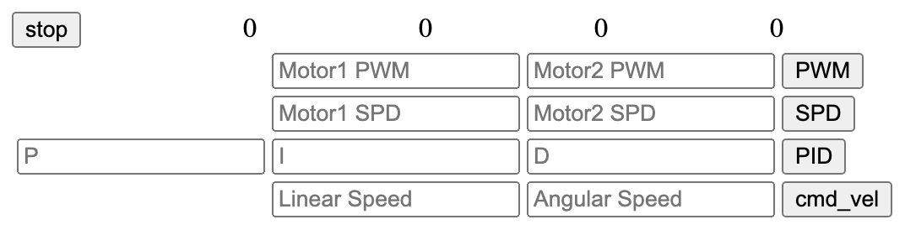

### UI ja ROS 2: ROSbridge ja roslib.js nopea esimerkki

Lopuksi luomme verkkosivun, joka helpottaa ROS 2 -järjestelmän testaamista ja komentojen lähettämistä. Sivulla näytetään enkooderin arvot ja sen hetkinen nopeus selkeästi ylärivillä. Lisäksi käyttäjä voi syöttää halutut arvot komentokenttiin ja suorittaa eri komentoja helposti painikkeilla.



Komentojen välittämiseksi verkkosivulta ROS 2 -järjestelmään tarvitsemme välikomponentin. ROSbridge-palvelin mahdollistaa ROS 2:n ja verkkosovellusten välisen kommunikoinnin WebSocket-yhteyden kautta. Tämän yhteyden hyödyntämiseen käytämme roslib.js-kirjastoa, joka tarjoaa helppokäyttöisen rajapinnan ROS 2:n topiceihin suoraan verkkosivuilta.

**RoblibJS** on JavaScript-kirjasto, joka helpottaa robotteihin liittyvää ohjelmointia ja kommunikointia verkkosivujen tai web-sovellusten kautta. Se mahdollistaa esimerkiksi robotin ohjauksen, sensoridataen lukemisen ja robotin tilan hallinnan helposti JavaScriptillä. Käytetään usein web-pohjaisissa robottiprojekteissa ja IoT-sovelluksissa, joissa tarvitaan reaaliaikaista yhteyttä ja kontrollia robotin toimintaa varten.

Käynnistetään ROSbridge

```bash
ros2 launch rosbridge_server rosbridge_websocket_launch.xml
```

Luodaan verkkosivu

**index.html**

```html
<html>
	<head>
   		<script type="text/javascript" src="https://cdn.jsdelivr.net/npm/roslib@1/build/roslib.min.js"></script>
    	<script type="text/javascript" src="ros.js"></script>
	   	<style type="text/css">
	      div {
	        width:100px;
	        display: inline-block;
	        text-align: right;
	      }
	   </style>
  	</head>
  	<body>
    	<button onClick="pwm(0,0);">stop</button>
    	<div id="m1speed">0</div>
    	<div id="m2speed">0</div>
    	<div id="m1encoder">0</div>
    	<div id="m2encoder">0</div>    
	   <table>
		   <tr>  
	   			<td></td>
	    		<td><input id="value1" placeholder="Motor1 PWM" /></td>
	    		<td><input id="value2" placeholder="Motor2 PWM"/></td>
	    		<td><button onClick="runPWM()">PWM</button></td>
	    	</tr>
	    	<tr>
	      		<td></td>
	    		<td><input id="value3" placeholder="Motor1 SPD"/></td>
	    		<td><input id="value4" placeholder="Motor2 SPD"/></td>
	    		<td><button onClick="runSPD()">SPD</button></td>
	    	</tr>
	    	<tr>
	    		<td><input id="value5" placeholder="P"/></td>
			    <td><input id="value6" placeholder="I"/></td>
			    <td><input id="value7" placeholder="D"/></td>
			    <td><button onClick="runPID()">PID</button></td>
		   </tr>
	    	<tr>
	      		<td></td>
	    		<td><input id="value8" placeholder="Linear Speed"/></td>
	    		<td><input id="value9" placeholder="Angular Speed"/></td>
	    		<td><button onClick="runCMD_VEL()">cmd_vel</button></td>
	    	</tr>
		</table>
	</body>
</html>
```

ja javascript tiedosto

**ros.js**

```javascript
const ROBOT_IP = "<robotin ip osoite>";

let cmd_raw = null;
let msg = null;

const ros = new ROSLIB.Ros({
  url : 'ws://'+ROBOT_IP+':9090',
  groovyCompatibility: false,
});

function cmd_vel(speed,rotate) {
  cmd_raw = new ROSLIB.Topic({
    ros: ros,
    name: "/cmd_vel",
    messageType: "geometry_msgs/msg/Twist",
  });

  msg = new ROSLIB.Message({
    linear:{
      x:parseFloat(speed),
      y:0.0,
      z:0.0
    },
    angular:{
      x:0.0,
      y:0.0,
      z:parseFloat(rotate)
    }
  });
  cmd_raw.publish(msg);
}

function spd(a,b) {
  cmd_raw = new ROSLIB.Topic({
    ros: ros,
    name: "/motor_command",
    messageType: "std_msgs/msg/String",
  });

  msg = new ROSLIB.Message({
    data:"SPD;"+a+";"+b+";"
  });

  cmd_raw.publish(msg);
}

function pid(a,b,c) {
  const cmd_tmp = new ROSLIB.Topic({
    ros: ros,
    name: "/motor_command",
    messageType: "std_msgs/msg/String",
  });

  const msg_tmp = new ROSLIB.Message({
    data:"PID;"+a+";"+b+";"+c+";"
  });

  cmd_tmp.publish(msg_tmp);
}

function pwm(a,b) {
  cmd_raw = new ROSLIB.Topic({
    ros: ros,
    name: "/motor_command",
    messageType: "std_msgs/msg/String",
  });

  msg = new ROSLIB.Message({
    data:"PWM;"+a+";"+b+";"
  });

  cmd_raw.publish(msg);
  cmd_raw=null;
  msg=null;
}

var listener = new ROSLIB.Topic({
  ros : ros,
  name : '/motor_data',
  messageType : 'motordriver_msgs/msg/MotordriverMessage',
});

listener.subscribe((message) => {
  document.getElementById("m1speed").innerHTML=message.speed1;
  document.getElementById("m2speed").innerHTML=message.speed2;

  document.getElementById("m1encoder").innerHTML=message.encoder1;
  document.getElementById("m2encoder").innerHTML=message.encoder2;

});

setInterval(myTimer, 2000);
function myTimer() {
  if(cmd_raw !== null && msg !== null) {
    cmd_raw.publish(msg);
  }
}

function runPWM() {
  let value1 = document.getElementById("value1").value;
  let value2 = document.getElementById("value2").value;
  pwm(value1,value2);
}

function runSPD() {
  let value1 = document.getElementById("value3").value;
  let value2 = document.getElementById("value4").value;
  spd(value1,value2);
}


function runPID() {
  let value1 = document.getElementById("value5").value;
  let value2 = document.getElementById("value6").value;
  let value3 = document.getElementById("value7").value;
  pid(value1,value2,value3);
}

function runCMD_VEL() {
  let value1 = document.getElementById("value8").value;
  let value2 = document.getElementById("value9").value;
  cmd_vel(value1,value2);
}
```

Asetetaan ROSbridge käynnistymään automaattisesti järjestelmän käynnistyessä

**/home/ros2/rosbridge\_autostart.sh**

```bash
#!/bin/bash

# Lataa ROS2-ympäristö
source /opt/ros/jazzy/setup.bash

# Lataa työtilan ympäristö
source /home/ros2/ros2_ws/install/setup.bash

# Suorita launch-tiedosto
ros2 launch rosbridge_server rosbridge_websocket_launch.xml
```

**/etc/systemd/system/ros2\_rosbridge.service**

```
[Unit]
Description="ROS2 Rosbridge Autostart"
After=network.target

[Service]
Type=simple
User=ros2
ExecStart=/home/ros2/rosbridge_autostart.sh
Restart=always
Environment="PYTHONUNBUFFERED=1"

[Install]
WantedBy=multi-user.target
```

```bash
# Käynnistä ROSbridge
sudo systemctl start ros2_rosbridge.service

# Aseta ROSbridge käynnistymään käynnistyksen yhteydessä
sudo systemctl enable ros2_rosbridge.service
```

-
Nomga Oy - SeAMK - ROS 2 ja moottorinohjaus: PWM-signaalista robottien liikkeenhallintaan