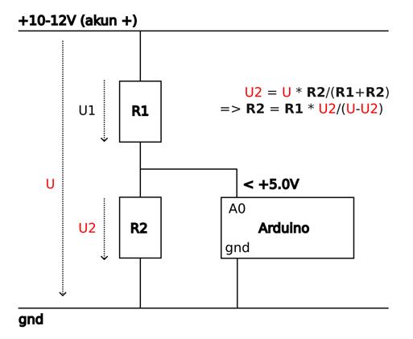

## Ekstra: Akun jännitteen seuranta ja hälytysvalo
LiPo-akun kunto heikkenee nopeasti, jos kennokohtainen jännite laskee liian alas. Jos raja-arvoksi otetaan 3,3V/kenno, niin SeBotissa käytettävän kolmikennoisen akun jännite ei saisi laskea alle noin 10V (ellei käytetä kehittyneempää kennokohtaista jännitteenseurantaa). Kehitetään SeBotin toiminnallisuuksia siten, että jännitteen laskiessa alle annetun tason hälytysvalo syttyy:
1) Tehdään jännitteenjakokytkentä, jonka avulla Arduino voi lukea moottoritietojen ohella myös akun jännitettä. 
2) Syötetään tämä tieto osana moottoreiden tilasta kertovaa merkkijonoa Raspberrylle, jossa motordriver-node parsii tiedon osaksi /motor_data topicia. 
3) Välitetään tieto erillisellä nodella omaan /battery_level topiciinsa ja
4) seurataan jännitteen tasoa nodella, joka toimittaa tiedon hälytystilan statuksesta /battery_alert topiciin ja sytyttää hälytysvalon.

### Jännitteenjakokytkentä
Arduinon analogisisääntulonastalle ei saa syöttää yli 5V jännitettä. Akun nimellisjännite on 12V eli se tulee skaalata siten, että 12V jännite näkyy Arduinolle hieman alle 5V jännitteenä. Tämä on kätevintä tehdä yksinkertaisella [jännitteenjakokytkennällä](https://fi.wikipedia.org/wiki/J%C3%A4nnitteen-_ja_virranjakos%C3%A4%C3%A4nt%C3%B6).



Kuva: Jännitteenjakokytkentä ja tarvittavat laskukaavat.

Vastukset R1 ja R2 tulee valita siten, että niiden keskinäinen suhde antaa jännitteeksi U2 kaikissa tapauksissa alle 5V jännitteen Arduinon nastalle A0. Toiseksi kokonaisvastuksen on syytä olla varsin suuri, jotta tämä "turha" virrankulutus jäisi mahdollisimman pieneksi.

Jos vastukseksi R1 valitaan 10 k $\Omega$ ja akun maksimijännite on U = 12,6V, niin laskennallisesti vastuksen R2 tulee olla 6,6 k $\Omega$. Haluamme kuitenkin hieman varmuusmarginaalia, joten hyvä valinta on R2 = 4,7 k $\Omega$. Tällöin U2_max = U_max * R2/(R1+R2) = 4,0 V.

### Arduino

Lisätään Arduinon motorcontroller.inu-tiedostoon tieto A0-nastan käyttämisestä analogisisääntulona, siltä luetun arvon lukeminen ja skaalaaminen jännitearvoksi ``ReadBatteryVoltage()``-funktiolla ja tämän jännitearvon lähettäminen osana muuta Raspberrylle toimitettavaa merkkijonoa.

Halutessasi voit mitata käyttämäsi vastusten resistanssin yleismittarilla jännitemittauksen tuloksen tarkentamiseksi.

**/opt/nomga/arduino/motorcontroller/motorcontroller.ino**
```c
#include "Motor.h"

const int voltagePin = A0;         // Analoginen sisääntulo nastassa A0
const float R1 = 9820.0;          // nimellisvastus 10k ohmia
const float R2 = 4720.0;           // nimellisvastus 4.7k ohmia
const float voltageScale = (R1 + R2) / R2; // ~3.13
...
```

```c
...
void sendData() {
  Serial.print(motor1.getEncoder());
  Serial.print(";");
  Serial.print(motor2.getEncoder());
  Serial.print(";");
  Serial.print(motor1.getSpeed());
  Serial.print(";");
  Serial.print(motor2.getSpeed());
  Serial.print(";");
  Serial.print(motor1.getMotorSpeed());
  Serial.print(";");
  Serial.print(motor2.getMotorSpeed());
  Serial.print(";");
  Serial.print(readBatteryVoltage(), 2); // Akun jännite kahden desimaalin tarkkuudella
  Serial.print("\n");
}

float readBatteryVoltage() {
  int raw = analogRead(voltagePin);            // 0–1023
  float voltage = (raw / 1023.0) * 5.0;         // Muunnetaan jännitteeksi
  return voltage * voltageScale;               // Skaalataan varsinaiseksi jännitteeksi.
}
```

Tallenna tiedosto ja käännä ja lataa se Arduinon muistiin ajamalla komennot
```bash
/opt/nomga/arduino/compile.sh
/opt/nomga/arduino/upload.sh
```

### Jännitteen lukeminen ROS2-ympäristössä
Arduino syöttää nyt merkkijononsa viimeisenä kenttänä tiedon jännitteestä. SeBotin arkkitehtuurissa tämän lukeminen kannattaa tehdä samassa yhteydessä kuin moottoreiden tietojen lukeminen eli ``motordriver`` nodessa. Tämä tieto voidaan julkaista samalla kertaa muun ``/motor_data`` topicin yhteydessä, jos päivitämme sen käyttämän tietotyypin yhdellä lisäkentällä. (Toinen, lopulta suoraviivaisempi vaihtoehto olisi julkaista akun jännitetieto suoraan omassa nodessaan. Tässä haluamme kuitenkin havainnollistaa topicien uudelleenjulkaisua erillisessä nodessa. Omana harjoituksenasi voit miettiä, miten oikaista tämän välivaiheen ohi.)

#### MotordriverMessage päivitys
Päivitetään ensin tietotyyppi lisäämällä yksi ``float32`` tyyppinen kenttä tiedoston loppuun.
**~/ros2_ws/src/motordriver_msgs/msg/MotordriverMessage.msg**
```
int32 encoder1
int32 encoder2
int32 speed1
int32 speed2
int32 pwm1
int32 pwm2
float32 battery
```

#### motordrive noden päivitys
Tämän jälkeen muokataan ``motordriver`` nodea siten, että se huomioi myös tämän lisätyn kentän
**~/ros2_ws/src/motordriver/motordriver/motordriver.py**
```python
... # luokan MotordriverNode konstruktoriin päivitetään mukaan jännitesimulointi, jos ajetaan simulaatiossa.
    # jos simulation parametria ei löydy niin oletuksena se on True
    self.declare_parameter('simulation', False)
    self.simulation = self.get_parameter('simulation').value
    self.get_logger().info(f'Käynnistetään motor_controller simulaatiossa: {self.simulation}')
    if self.simulation:
      self.arduino = SimSerial()
      self.voltageDifference = 0
      self.startingVoltage = 12.6
    else:
      self.arduino = serial.Serial("/dev/ttyACM0", 115200, timeout=1)
      if not self.arduino.isOpen():
        raise Exception("Ei yhteyttä moottoriohjaimeen")
...
  def timer_callback(self):
    # Create a message
    if self.msg != "x\n":
        self.arduino.write(self.msg.encode())
    

    if self.timercount == 11:
        if self.msg == "x\n":
            self.arduino.write(self.msg.encode())
        self.msg = "x\n"

        self.timercount = 0
        if self.arduino.inWaiting()>0:
          while self.arduino.inWaiting()>0: 
            answer=self.arduino.readline().decode("utf8").split(";")
            if(self.simulation):
              self.voltageDifference -= 0.001 
              answer.append(float(self.startingVoltage+self.voltageDifference))
          msg = MotordriverMessageBattery()
          
          try:
            msg.encoder1 = int(answer[0])
            msg.encoder2 = int(answer[1])
            msg.speed1 = int(answer[2])
            msg.speed2 = int(answer[3])
            msg.pwm1 = int(answer[4])
            msg.pwm2 = int(answer[5])
            msg.battery = float(answer[6])
            # Publish the message
            self.publisher.publish(msg)
          except Exception as err:
            self.get_logger().info(f'Virhe: {err}')
            pass

    self.timercount += 1
...
```
#### Uusi ``battery``-paketti
Harjoituksen vuoksi teemme uuden ROS2-paketin, johon luomme kaksi erillistä nodea:
1) ``battery_republish`` joka poimii akun jännitetiedon ja julkaisee sen omassa topicissaan ``/battery_voltage`` ja
2) ``battery_alert`` joka lukee kyseistä topicia ja havaitessaan jännitteen laskeneen alle asetetun hälytysrajan julkaisee ``/battery_alert`` topicissa asiasta hälyttävää viestiä. Lisäksi node sytyttää hälytysvalon.

Luodaan uusi paketti ``battery``
```bash
cd ~/ros2_ws/src/
ros2 pkg create --build-type ament_python battery
cd ~/ros2_ws/src/battery/battery
```

Luodaan kyseiseen hakemistoon kaksi tiedostoa:
**~/ros2_ws/src/battery/battery/battery_republish.py**
```python
import rclpy
from rclpy.node import Node

from std_msgs.msg import String

import time

from motordriver_msgs.msg import MotordriverMessage

from std_msgs.msg import Float32

class BatteryRedirector(Node):
    def __init__(self):
        super().__init__('battery_redirector')
        self.declare_parameter('battery_check_interval', 10.0) # Parametri jännitteen luvun aikavälille, sekuntia.
        self.publish_interval = self.get_parameter('battery_check_interval').value

        self.sub = self.create_subscription(MotordriverMessage, '/motor_data', self.callback, 10)
        self.pub = self.create_publisher(Float32, '/battery_voltage', 10)
        self.previous_time = time.time()
        self.get_logger().info(f"Akun jännitteen lukuaika asetettu arvoon {self.publish_interval:.2f} s")

    def callback(self, msg):
        time_now = time.time()
        time_interval = time_now - self.previous_time
        if time_interval > self.publish_interval:
            battery_msg = Float32()
            battery_msg.data = msg.battery
            self.pub.publish(battery_msg)
            self.previous_time = time_now

def main(args=None):
  rclpy.init(args=args)
  batteryredirector_node = BatteryRedirector()
  try:
    rclpy.spin(batteryredirector_node)
  except KeyboardInterrupt:
    pass
  finally:
    batteryredirector_node.destroy_node()
    if rclpy.ok():
      rclpy.shutdown()

if __name__ == '__main__':
  main()

```

**~/ros2_ws/src/battery/battery/battery_alert.py**
```python
import rclpy
from rclpy.node import Node
from std_msgs.msg import String
import time
from std_msgs.msg import Bool, Float32

import lgpio

class BatteryAlert(Node):
    def __init__(self):
        super().__init__('battery_alert_node')

        self.declare_parameter('threshold', 12.0) # Oletusarvo 12.0 V, tämä tulee nopeasti vastaan täydelläkin akulla aloitettaessa.
        self.threshold = self.get_parameter('threshold').get_parameter_value().double_value
        self.get_logger().info(f"Akun jännitteen alaraja asetettu arvoon {self.threshold:.2f} V")
        
        self.sub = self.create_subscription(Float32, '/battery_voltage', self.voltage_callback, 10)
        self.sub_alert = self.create_subscription(Bool, '/battery_alert', self.alert_callback, 10)
        self.pub = self.create_publisher(Bool, '/battery_alert', 10)
        self.previous_alert_state = False

        # Julkaistaan yhden kerran oletuksena /battery_alertissa False, jotta siellä näkyy varmasti jotain.
        battery_alert_msg = Bool()
        battery_alert_msg.data = self.previous_alert_state
        self.pub.publish(battery_alert_msg)
    
        # Määritellään GPIO nasta hälytys-LEDille
        self.LED_PIN = 18
        # Valitaan GPIO-siru (vakio Raspberry Pille)
        self.chip = lgpio.gpiochip_open(4)
        # Asetetaan LED_PIN ulostuloksi
        lgpio.gpio_claim_output(self.chip, self.LED_PIN)
        # Alustetaan LED_PIN alas (nollaksi)
        lgpio.gpio_write(self.chip, self.LED_PIN, 0)

    # Tämä callback kutsutaan kun /battery_alert topiciin tulee viestejä.
    def alert_callback(self, msg):
        if msg.data == True:
            pass
            lgpio.gpio_write(self.chip, self.LED_PIN, 1)  
        else:
            pass
            lgpio.gpio_write(self.chip, self.LED_PIN, 0)  

    def voltage_callback(self, msg):
        if msg.data < self.threshold:
            alert_state = True
        else:
            alert_state = False
        
        if self.previous_alert_state != alert_state: # Julkaistaan /battery_alert tieto vain jos se on muuttunut edellisestä.
            battery_alert_msg = Bool()
            battery_alert_msg.data = alert_state
            self.pub.publish(battery_alert_msg)
            self.previous_alert_state = alert_state

def main(args=None):
  rclpy.init(args=args)
  batteryalert_node = BatteryAlert()
  
  try:
    rclpy.spin(batteryalert_node)
  except KeyboardInterrupt:
    pass

  finally:
      batteryalert_node.destroy_node()
      lgpio.gpio_write(batteryalert_node.chip, batteryalert_node.LED_PIN, 0)
      lgpio.gpiochip_close(batteryalert_node.chip)
      if rclpy.ok():
          rclpy.shutdown()

if __name__ == '__main__':
  main()


```

Päivitetään vielä ``setup.py`` jotta saamme käynnistettyä nodet ``ros2 run`` komennolla.

**~/ros2_ws/src/battery/setup.py**
```python
from setuptools import find_packages, setup

package_name = 'battery'

setup(
    name=package_name,
    version='0.0.0',
    packages=find_packages(exclude=['test']),
    data_files=[
        ('share/ament_index/resource_index/packages',
            ['resource/' + package_name]),
        ('share/' + package_name, ['package.xml']),
    ],
    install_requires=['setuptools'],
    zip_safe=True,
    maintainer='sebot',
    maintainer_email='sebot@todo.todo',
    description='TODO: Package description',
    license='Apache-2.0',
    tests_require=['pytest'],
    entry_points={
        'console_scripts': [
            'battery_republish = battery.battery_republish:main',
            'battery_alert = battery.battery_alert:main',
        ],
    },
)
```
Yhdistä GPIO 18 nastaan haluamasi LED ja sen etuvastus. Tämä voi olla kätevää yhdistää ``materiaali-4-diffdrive``-osiossa mainitun "kaikki valmista LED:in" kanssa siten, että käytetään samaa maa-nastaa 14, joka on nastojen GPIO18 ja GPIO23 välissä, katso kuva alta.


#### Battery paketin kääntäminen ja testaus
Nyt voit kääntää muokatut ja lisätyt paketit ja ottaa sen mukaan ROS2-ympäristöön:
```bash
cd ~/ros2_ws
colcon build
source ./install/setup.bash
```

Kokeile nodejen toiminta ajamalla erillisissä päätteissä komennot (tässä oletetaan että mikään node ei ole valmiiksi käynnissä):
**Terminaali 1**
```bash
ros2 launch diffdrive diffdrive.launch.py # käynnistetään kaikki muut nodet, jotta SeBot on ajovalmis
```

**Terminaali 2**
```bash
ros2 run battery battery_republish
```

**Terminaali 3**
```bash
ros2 run battery battery_alert
```

**Terminaali 4**
```bash
ros2 topic list
ros2 topic echo /battery_voltage
ros2 topic echo /battery_alert
```

``/battery_alert`` topiciin pitäisi ilmestyä vähintään yksi "False", vaikka akun jännite olisi heti aluksi alle asetetun kynnysarvon. Kynnysarvo on oletuksena korkea 12 V, jotta sen vaikutuksen näkisi nopeasti vaikka akku olisi aluksi täysikin.

Mikäli kaikki toimii, topicissa ``/battery_voltage`` näkyy ajantasainen jännite ja GPIO nastaan 18 kytketyn LEDin pitäisi syttyä, kun akun jännite laskee alle kynnysarvon. Tämän pitäisi näkyä myös ``/battery_alert`` topicissa tilan muutoksesta kertovana viestinä.

**Huomaa** että isommissa ROS2-järjestelmissä tämäntapainen toiminto toteutetaan todennäköisemmin ``service``nä siten, että jännitteen laskiessa liian alas kutsutaan esimerkiksi ``set_battery_alert`` serviceä arvolla True, joka sitten hoitaa tarvittavat toimet esimerkiksi LEDin sytyttämisen tai järjestelmän alasajamisen mielessä. Tässä harjoituksessa ei kuitenkaan käsitellä servicejä, joten toiminnallisuus hoidetaan topiceilla.

#### Launch tiedosto
Muokataan vielä ``diffdrive``-paketin launch-tiedostoa, jotta koko järjestelmä lähtee samalla kerralla käyntiin:

> Huomaa, että alla olevassa launch-tiedostossa ei oteta käyttöön ``namespace``-toiminnallisuutta. Jos haluat käyttää montaa SeBotia samassa ROS2-verkossa, ota mallia ``materiaali-2-motordriver`` ja ``materiaali-4-diffdrive`` materiaaleista.

**~/ros2_ws/src/diffdrive/launch/diffdrive.launch.py**
```python
import os
from ament_index_python.packages import get_package_share_directory
from launch import LaunchDescription
from launch.actions import DeclareLaunchArgument
from launch.substitutions import LaunchConfiguration
from launch_ros.actions import Node

def generate_launch_description():
    use_sim_time = LaunchConfiguration('use_sim_time', default='false')

    colcon_prefix_path = os.getenv('COLCON_PREFIX_PATH').split("/install")[0]

    urdf_file_name = 'robot.urdf'
    urdf = os.path.join(
        colcon_prefix_path,
        'config',
        urdf_file_name)
    with open(urdf, 'r') as infp:
        robot_desc = infp.read()
    
    
    return LaunchDescription([
        DeclareLaunchArgument(
            'use_sim_time',
            default_value='false',
            description='Use simulation (Gazebo) clock if true'),
        Node(
            package='robot_state_publisher',
            executable='robot_state_publisher',
            name='robot_state_publisher',
            output='screen',
            parameters=[{'use_sim_time': use_sim_time, 'robot_description': robot_desc}],
            arguments=[urdf]),

        #Node(
        #    package='tf2_web_republisher_py',
        #    executable='tf2_web_republisher',
        #    name='tf2_web_republisher',
        #    output='screen',
        #  ),

        Node(
            package='motordriver',
            executable='motordriver',
            name='motordriver_node',
            output='screen',
            parameters=[os.path.join(
              colcon_prefix_path,
              'config',
              'params.yaml')] 
          ),

        Node(
            package='diffdrive',
            executable='odom',
            name='odom_node',
            output='screen',
            parameters=[os.path.join(
              colcon_prefix_path,
              'config',
              'params.yaml')]
          ),

        Node(
            package='diffdrive',
            executable='cmd_vel',
            name='cmd_vel_node',
            output='screen',
            parameters=[os.path.join(
              colcon_prefix_path,
              'config',
              'params.yaml')]  
          ),            

        Node(
            package='diffdrive',
            executable='pi_led',
            name='pi_led_node',
            output='screen',
          ), 

        Node(
            package='battery',
            executable='battery_republish',
            name='battery_republish_node',
            parameters=[os.path.join(
              colcon_prefix_path,
              'config',
              'params.yaml')],       
            output='screen',
          ),

        Node(
            package='battery',
            executable='battery_alert',
            name='battery_alert_node',
            parameters=[os.path.join(
              colcon_prefix_path,
              'config',
              'params.yaml')],
            output='screen',
          ),            

    ])
```

Lopuksi päivitetään ``params.yaml`` uusilla parametreillä:
```yaml
...
battery_republish_node:
  ros__parameters:
    threshold: 10.5
battery_alert_node:
  ros__parameters:
    battery_check_interval: 10.0
```

Nyt voit kääntää muokatut ja lisätyt paketit ja ottaa sen mukaan ROS2-ympäristöön:
```bash
cd ~/ros2_ws
colcon build
source ./install/setup.bash
```
-

Nomga Oy - SeAMK - ROS 2 ja moottorinohjaus: PWM-signaalista robottien liikkeenhallintaan